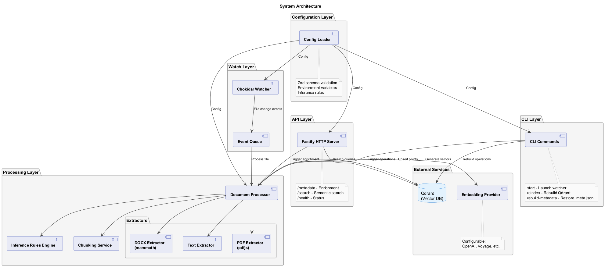

# @karmaniverous/jeeves-watcher

Filesystem watcher that keeps a Qdrant vector store in sync with document changes.

## Overview

`jeeves-watcher` monitors a configured set of directories for file changes, extracts text content, generates embeddings, and maintains a synchronized Qdrant vector store for semantic search. It automatically:

- **Watches** directories for file additions, modifications, and deletions
- **Extracts** text from various formats (Markdown, PDF, DOCX, HTML, JSON, plain text)
- **Chunks** large documents for optimal embedding
- **Embeds** content using configurable providers (Google Gemini, OpenAI, etc.)
- **Syncs** to Qdrant for fast semantic search
- **Enriches** metadata via rules and API endpoints

### Architecture



For detailed architecture documentation, see [guides/architecture.md](guides/architecture.md).

## Quick Start

### Installation

```bash
npm install -g @karmaniverous/jeeves-watcher
```

### Initialize Configuration

Create a new configuration file in your project:

```bash
jeeves-watcher init
```

This generates a `.jeeves-watcher.json` file with sensible defaults.

### Configure

Edit `.jeeves-watcher.json` to specify:

- **Watch paths**: Directories to monitor
- **Embedding provider**: Google Gemini, OpenAI, or custom
- **Qdrant connection**: URL and collection name
- **Inference rules**: Automatic metadata enrichment based on file patterns

Example minimal configuration:

```json
{
  "watch": {
    "paths": ["./docs"],
    "ignored": ["**/node_modules/**", "**/.git/**"]
  },
  "embedding": {
    "provider": "google",
    "model": "gemini-embedding-001",
    "apiKey": "${GOOGLE_API_KEY}"
  },
  "vectorStore": {
    "url": "http://localhost:6333",
    "collectionName": "my_docs"
  }
}
```

### Start Watching

```bash
jeeves-watcher start
```

The watcher will:
1. Index all existing files in watched directories
2. Monitor for changes
3. Update Qdrant automatically

## CLI Commands

| Command | Description |
|---------|-------------|
| `jeeves-watcher start` | Start the filesystem watcher (foreground) |
| `jeeves-watcher init` | Initialize a new configuration file |
| `jeeves-watcher status` | Show watcher status |
| `jeeves-watcher reindex` | Reindex all watched files |
| `jeeves-watcher rebuild-metadata` | Rebuild metadata files from Qdrant payloads |
| `jeeves-watcher search <query>` | Search the vector store |
| `jeeves-watcher enrich <path>` | **Planned — not yet implemented** |
| `jeeves-watcher validate` | Validate the configuration |
| `jeeves-watcher service` | Manage the watcher as a system service |
| `jeeves-watcher config-reindex` | Reindex after configuration changes (rules only or full) |

## Configuration

### Watch Paths

```json
{
  "watch": {
    "paths": ["./docs", "./notes"],
    "ignored": ["**/node_modules/**", "**/*.tmp"]
  }
}
```

- **`paths`**: Array of glob patterns or directories to watch
- **`ignored`**: Array of patterns to exclude

### Embedding Provider

#### Google Gemini

```json
{
  "embedding": {
    "provider": "google",
    "model": "gemini-embedding-001",
    "apiKey": "${GOOGLE_API_KEY}"
  }
}
```

#### OpenAI

```json
{
  "embedding": {
    "provider": "openai",
    "model": "text-embedding-3-small",
    "apiKey": "${OPENAI_API_KEY}"
  }
}
```

### Vector Store

```json
{
  "vectorStore": {
    "url": "http://localhost:6333",
    "collectionName": "my_collection"
  }
}
```

### Inference Rules

Automatically enrich metadata based on file patterns:

```json
{
  "inferenceRules": [
    {
      "match": {
        "properties": {
          "file": {
            "type": "object",
            "properties": {
              "path": { "type": "string", "glob": "**/meetings/**" }
            }
          }
        }
      },
      "set": {
        "domain": "meetings",
        "category": "notes"
      }
    }
  ]
}
```

### Chunking

Chunking settings are configured under `embedding`:

```json
{
  "embedding": {
    "chunkSize": 1000,
    "chunkOverlap": 200
  }
}
```

### Metadata Storage

```json
{
  "metadataDir": ".jeeves-metadata"
}
```

Metadata is stored as JSON files alongside watched documents.

## API Endpoints

The watcher provides a REST API (default port: 3456):

| Endpoint | Method | Description |
|----------|--------|-------------|
| `/status` | GET | Health check and uptime |
| `/search` | POST | Semantic search (`{ query: string, limit?: number }`) |
| `/metadata` | POST | Update document metadata (`{ path: string, metadata: object }`) |
| `/reindex` | POST | Reindex all watched files |
| `/rebuild-metadata` | POST | Rebuild metadata files from Qdrant |
| `/config-reindex` | POST | Reindex after config changes (`{ scope?: "rules" \| "full" }`) |

### Example: Search

```bash
curl -X POST http://localhost:3456/search \
  -H "Content-Type: application/json" \
  -d '{"query": "machine learning algorithms", "limit": 5}'
```

### Example: Update Metadata

```bash
curl -X POST http://localhost:3456/metadata \
  -H "Content-Type: application/json" \
  -d '{
    "path": "/path/to/document.md",
    "metadata": {
      "priority": "high",
      "category": "research"
    }
  }'
```

## Supported File Formats

- **Markdown** (`.md`, `.markdown`) — with YAML frontmatter support
- **PDF** (`.pdf`) — text extraction
- **DOCX** (`.docx`) — Microsoft Word documents
- **HTML** (`.html`, `.htm`) — content extraction (scripts/styles removed)
- **JSON** (`.json`) — with smart text field detection
- **Plain Text** (`.txt`, `.text`)

## License

BSD-3-Clause
