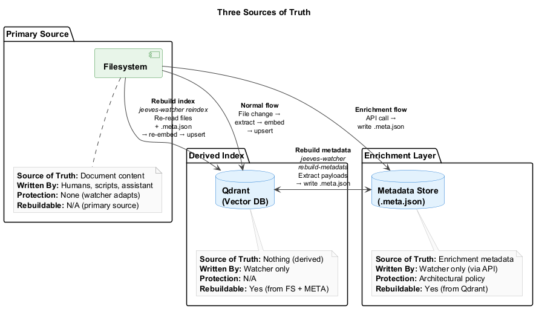
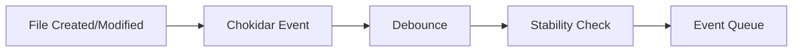
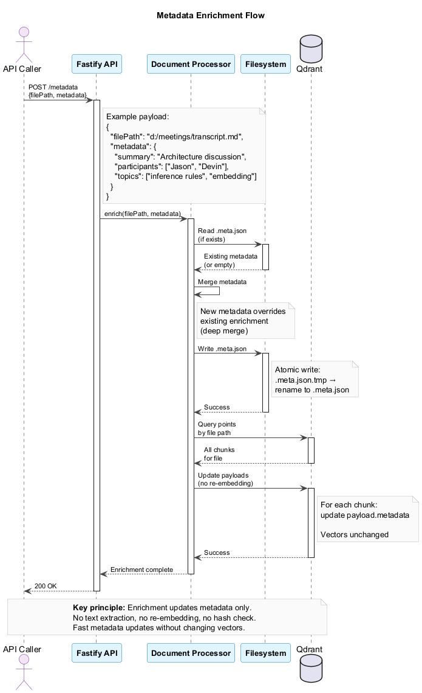
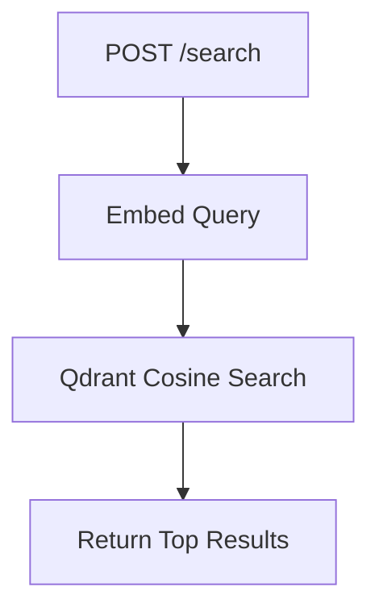

# Architecture

High-level architectural overview of `jeeves-watcher` for contributors and advanced users.

## Design Principles

1. **Files are just files** — Processes write to the filesystem normally. The watcher discovers changes passively.
2. **Config-driven, no domain logic** — The watcher doesn't know what an "email" or "meeting" is. Domain semantics live in config (inference rules).
3. **Embedding is swappable** — Change embedding providers by changing one config line. No code changes.
4. **Metadata enrichment is optional** — The watcher works without it, but callers can enrich documents for better search quality.
5. **Three sources of truth** — Filesystem owns content, metadata store owns enrichment, Qdrant is a derived index (fully rebuildable).

---

## System Architecture


The watcher consists of several layered components:

- **Configuration Layer** — Zod-validated config with environment variable substitution
- **Watch Layer** — Chokidar filesystem watcher + event queue
- **Processing Layer** — Document processor with extractors, chunking, and inference rules engine
- **External Services** — Configurable embedding provider + Qdrant vector store
- **API Layer** — Fastify HTTP server for enrichment and search
- **CLI Layer** — Command-line interface for operations

---

## Three Sources of Truth



The system maintains three distinct stores:

- **Filesystem** (watched directories) — Primary source of document content
- **Metadata Store** (`.meta.json` sidecars) — Enrichment metadata added via API
- **Qdrant** (vector database) — Derived index, fully rebuildable

### Rebuild Flows

**Qdrant lost → Rebuild from filesystem + metadata store:**

```bash
jeeves-watcher reindex
```

Reads files from disk, reads `.meta.json` sidecars, re-embeds content, upserts to Qdrant.

**Metadata store lost → Rebuild from Qdrant:**

```bash
jeeves-watcher rebuild-metadata
```

Scrolls Qdrant points, extracts enrichment metadata from payloads, writes `.meta.json` files.

---

## Data Flow

### 1. File Change Event



**Debounce:** Wait `watch.debounceMs` after the last change event (prevents re-embedding during rapid edits).

**Stability Check:** File size must be unchanged for `watch.stabilityThresholdMs` (prevents embedding partial writes).

### 2. Document Processing Pipeline


The core processing flow transforms file changes into searchable vectors:

1. **Extract Text** — Format-specific extraction (PDF, DOCX, Markdown, etc.)
2. **Content Hash** — SHA-256 hash of extracted text for change detection
3. **Hash Check** — Skip re-embedding if content unchanged
4. **Build Attributes** — Collect file metadata (path, size, modified, frontmatter, JSON)
5. **Apply Inference Rules** — Match → Set → Map → Merge (see [Inference Rules](inference-rules.md))
6. **Read Enrichment Metadata** — Load `.meta.json` sidecar if exists
7. **Merge Metadata** — Combine inference rules + enrichment (enrichment wins)
8. **Chunk Text** — Split large documents with overlap
9. **Embed Chunks** — Generate vectors via embedding provider
10. **Upsert to Qdrant** — Store vectors + payloads
11. **Cleanup Orphaned Chunks** — Remove old chunks if document shrunk

### 3. Metadata Enrichment (API)



The enrichment API allows external callers to add metadata without re-embedding:

1. **POST /metadata** with file path and metadata
2. **Read existing** `.meta.json` sidecar (if exists)
3. **Merge metadata** — new metadata overrides existing (deep merge)
4. **Write `.meta.json`** — atomic write via temp file + rename
5. **Update Qdrant payloads** — modify all chunk payloads for the file

**Key principle:** Enrichment updates metadata only. No text extraction, no re-embedding, no hash check. Fast metadata updates without changing vectors.

### 4. Search Flow



**Chunk deduplication:** Search returns individual chunks. Callers group by `file_path` to get unique documents.

---

## Chunking Strategy

Documents exceeding `embedding.chunkSize` (default: 1000 characters) are split into chunks.

**Splitters:**

- **Markdown files** (`.md`, `.markdown`) — `MarkdownTextSplitter` (splits on heading boundaries, preserves structure)
- **All other files** — `RecursiveCharacterTextSplitter` (splits on `\n\n`, then `\n`, then `. `, then characters)

Both splitters use:
- `chunkSize` — max characters per chunk
- `chunkOverlap` — overlap between consecutive chunks (helps preserve context at boundaries)

**Chunk Points:**

Each chunk becomes a separate Qdrant point with:
- **Unique ID:** `pointId(filePath, chunkIndex)` (deterministic UUID)
- **Shared payload:** `file_path`, `domain`, metadata (same across all chunks)
- **Chunk-specific:** `chunk_index`, `total_chunks`, `chunk_text`

**Example:**

File with 3 chunks → 3 Qdrant points:

| Point ID | `chunk_index` | `total_chunks` | `chunk_text` |
|----------|---------------|----------------|--------------|
| `uuid-0` | `0` | `3` | "First chunk..." |
| `uuid-1` | `1` | `3` | "Second chunk..." |
| `uuid-2` | `2` | `3` | "Third chunk..." |

---

## Content Hashing

Every processed file gets a content hash (`sha256` of extracted text) stored in the Qdrant payload.

**On file modify events:**

1. Extract text
2. Compute hash
3. Query Qdrant for existing point
4. If `content_hash` matches → **skip** (no re-embed, no API call)
5. If hash differs → re-embed and upsert

**Benefits:**

- Saves embedding API calls on cosmetic changes (whitespace, metadata-only edits)
- Prevents unnecessary Qdrant writes
- Speeds up reindex (only changed files are re-embedded)

---

## Point ID Generation

Qdrant point IDs are **deterministic UUIDs** derived from file paths:

```javascript
import { v5 as uuidv5 } from 'uuid';

const NAMESPACE = '6a6f686e-6761-6c74-2d6a-656576657321'; // fixed

function pointId(filePath: string, chunkIndex: number): string {
  const normalized = filePath.toLowerCase().replace(/\\/g, '/');
  return uuidv5(`${normalized}:${chunkIndex}`, NAMESPACE);
}
```

**Why deterministic:**

- Same file always produces the same ID
- No need to store ID anywhere — it's computable from the path
- Renames are a delete + insert (old ID removed, new ID created)

**Trade-off:** Renaming/moving files changes their identity in the index. Acceptable — the watcher handles it transparently.

---

## Event Processing

### Event Queue

File events are queued and processed **sequentially** to maintain consistency.

**Concurrency:** Embedding API calls are parallelized (up to `embedding.concurrency`), bounded by a rate limiter (`embedding.rateLimitPerMinute`).

**Same-path serialization:** Events for the same file path are always processed in order (prevents race conditions).

### Startup Behavior

On service start:

1. Scan all `watch.paths` globs
2. Compare filesystem state against Qdrant (by point ID)
3. Index new files (in filesystem but not Qdrant)
4. Remove stale entries (in Qdrant but file no longer exists)
5. Re-embed modified files (content hash mismatch)

This ensures consistency after service downtime or crashes.

### Config Change Handling

When `configWatch.enabled` is `true`, the watcher monitors its own config file.

**On config change:**

1. Debounce for `configWatch.debounceMs` (default: 1000ms)
2. Reload and validate config
3. Recompile inference rules
4. Queue a **scoped metadata reindex** (only files matching changed rules)

**Scoped reindex:**

- If a rule targeting `d:/meetings/**` changes, only files under `d:/meetings/` are re-evaluated
- No re-embedding — just metadata updates to Qdrant payloads

---

## Metadata Store Design

### Path Derivation

Metadata sidecars mirror the watched filesystem hierarchy:

```
File:     D:\projects\readme.md
Sidecar:  {metadataDir}/d/projects/readme.md.meta.json
```

**Algorithm:**

```javascript
function metadataPath(filePath: string, metadataDir: string): string {
  const normalized = filePath.replace(/^([A-Z]):/i, (_, d) => d.toLowerCase());
  return path.join(metadataDir, normalized + '.meta.json');
}
```

**Lookup:** O(1) — `fs.existsSync(metadataPath)`. No index required.

### File Format

Each `.meta.json` contains **only enrichment metadata** (not content or embeddings):

```json
{
  "title": "Project Overview",
  "labels": ["documentation", "important"],
  "author": "jeeves",
  "enriched_at": "2026-02-20T08:00:00Z"
}
```

### Write Policy

The metadata store is **watcher-owned**. Only the watcher process writes to it, only via the `POST /metadata` API.

**Enforcement:** Architectural policy (no filesystem permissions, cross-platform consistency).

---

## Inference Rules Engine

Rules are **JSON Schema `match` + `set` actions**, evaluated in order against file attributes.

**Attributes:**

```json
{
  "file": {
    "path": "d:/meetings/2026-02-20/transcript.md",
    "directory": "d:/meetings/2026-02-20",
    "filename": "transcript.md",
    "extension": ".md",
    "sizeBytes": 4523,
    "modified": "2026-02-20T08:15:00Z"
  },
  "frontmatter": { "title": "Meeting Notes", "author": "jeeves" },
  "json": { "participants": ["Jason", "Devin"] }
}
```

**Rule example:**

```json
{
  "match": {
    "properties": {
      "file": {
        "properties": {
          "path": { "type": "string", "glob": "d:/meetings/**" }
        }
      }
    }
  },
  "set": {
    "domain": "meetings"
  },
  "map": "extractProject"
}
```

**Processing order for each matching rule:**

1. **`match`** — JSON Schema validation against file attributes
2. **`set`** — Template interpolation (`${...}`) resolves against attributes
3. **`map`** — JsonMap transformation (inline or named reference)
4. **Merge** — `map` output overrides `set` output on field conflict

**Custom `glob` format:** Picomatch glob matching registered as an ajv custom keyword. This is the only custom format — everything else is pure JSON Schema.

**Template interpolation in `set`:**

```json
{
  "set": {
    "title": "${frontmatter.title}",
    "directory": "${file.directory}"
  }
}
```

**JsonMap transformations (`map`):**

Rules can reference named maps from the top-level `maps` config, or include inline JsonMap definitions. The watcher provides lib functions for path manipulation: `split`, `slice`, `join`, `toLowerCase`, `replace`, `get`.

See [Inference Rules Guide](./inference-rules.md) for full details.

---

## Text Extraction

### Extractors by File Type

| Extension | Extractor | Strategy |
|-----------|-----------|----------|
| `.md`, `.markdown` | `markdown` | Strip YAML frontmatter (extract as metadata), return body text |
| `.txt`, `.text` | `plaintext` | Return as-is |
| `.json` | `json-content` | Extract string values from known content fields (`content`, `body`, `text`, `subject`) |
| `.pdf` | `pdf-parse` | Extract text via `unpdf` library |
| `.docx` | `docx-extract` | Extract text via `mammoth` library |
| `.html`, `.htm` | `html-to-text` | Strip tags via `cheerio` library |

**Binary files without extractors** (e.g., `.png`, `.svg`) are **skipped** — no embedding, no Qdrant entry.

---

## Error Handling & Retry

Transient failures (Gemini API, Qdrant) are handled with exponential backoff:

| Failure Type | Retry Policy | Max Retries |
|-------------|-------------|-------------|
| Gemini 429 (rate limit) | Backoff from 1s, respect `Retry-After` | 5 |
| Gemini 500/503 | Backoff from 2s | 3 |
| Qdrant connection refused | Backoff from 5s | 10 |
| Text extraction error | No retry (log and skip) | 0 |

**Dead-letter list:** Files that fail all retries are moved to an in-memory dead-letter list (persisted to `{metadataDir}/.dead-letter.json`). Surfaced via `GET /status` and retried on next restart.

---

## Graceful Shutdown

On SIGTERM/SIGINT:

1. Stop accepting new filesystem events
2. Drain current in-flight operations (wait up to `shutdownTimeoutMs`)
3. Flush pending Qdrant writes
4. Persist dead-letter list
5. Exit cleanly

Partially processed files are safe — startup behavior re-processes them by comparing filesystem state against Qdrant.

---

## Collection Bootstrap

On first startup, if the Qdrant collection doesn't exist, the watcher creates it:

```javascript
await qdrant.createCollection(collectionName, {
  vectors: {
    size: config.embedding.dimensions,
    distance: 'Cosine'
  }
});
```

**Dimension mismatch:** If the collection exists with different dimensions (e.g., after switching embedding providers), the watcher logs an error and refuses to start.

**Recovery:** Delete the collection manually (or rename `collectionName` in config), then restart.

---

## Logging

Structured JSON logging via [pino](https://github.com/pinojs/pino):

| Level | Events |
|-------|--------|
| `info` | File indexed, file deleted, reindex started/completed, config reloaded |
| `warn` | Extraction failed, dead-letter entry, dimension mismatch |
| `error` | Embedding API failure (after retries), Qdrant write failure, startup failure |
| `debug` | Hash match (skip), debounce, queue depth, chunk processing |

**Log format:** JSON lines (parseable by standard log aggregators).

---

## Technology Choices

| Component | Library | Rationale |
|-----------|---------|-----------|
| Filesystem watcher | `chokidar` | Cross-platform, glob support, battle-tested |
| HTTP framework | `fastify` | Lightweight, fast, schema validation |
| Text splitting | `@langchain/textsplitters` | Markdown-aware + recursive splitting |
| JSON Schema validation | `ajv` | Fast, extensible (custom `glob` format) |
| Embedding client | Direct HTTP (Gemini REST API) | No SDK bloat |
| Qdrant client | `@qdrant/js-client-rest` | Official client, typed |
| Logging | `pino` | Structured JSON, low overhead |

---

## Extending the Watcher

### Add a New Extractor

1. Implement extractor function in `src/extractors/index.ts`:

```typescript
async function extractYaml(filePath: string): Promise<ExtractionResult> {
  const content = await fs.readFile(filePath, 'utf8');
  const parsed = YAML.parse(content);
  return {
    text: JSON.stringify(parsed, null, 2),
    frontmatter: undefined,
    json: parsed
  };
}
```

2. Register in config:

```json
{
  "extractors": {
    ".yaml": "yaml-content"
  }
}
```

### Add a New Embedding Provider

1. Implement provider in `src/embedding/index.ts`:

```typescript
class MyEmbeddingProvider implements EmbeddingProvider {
  async embed(texts: string[]): Promise<number[][]> {
    // Call your provider's API
  }
}
```

2. Register in factory:

```typescript
export function createEmbeddingProvider(config: EmbeddingConfig): EmbeddingProvider {
  if (config.provider === 'my-provider') return new MyEmbeddingProvider(config);
  // ...
}
```

3. Use in config:

```json
{
  "embedding": {
    "provider": "my-provider",
    "model": "my-model",
    "apiKey": "${MY_API_KEY}"
  }
}
```

---

## Next Steps

- [Configuration Reference](./configuration.md) — All config options
- [Inference Rules Guide](./inference-rules.md) — Rules engine deep dive
- [API Reference](./api-reference.md) — HTTP endpoints
- [Deployment Guide](./deployment.md) — Production setup
