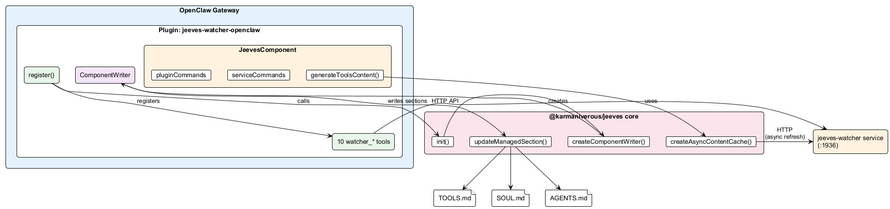

# OpenClaw Integration Guide

The `@karmaniverous/jeeves-watcher-openclaw` plugin gives your OpenClaw agent access to jeeves-watcher's semantic search, metadata enrichment, and management capabilities.

## Installation

### Standard (OpenClaw CLI)

```bash
openclaw plugins install @karmaniverous/jeeves-watcher-openclaw
```

### Self-Installer

OpenClaw's `plugins install` command has a known bug on Windows where it fails with `spawn EINVAL` or `spawn npm ENOENT` ([#9224](https://github.com/openclaw/openclaw/issues/9224), [#4557](https://github.com/openclaw/openclaw/issues/4557), [#6086](https://github.com/openclaw/openclaw/issues/6086)). This package includes a self-installer that works around the issue:

```bash
npx @karmaniverous/jeeves-watcher-openclaw install
```

The installer:

1. Copies the plugin into OpenClaw's extensions directory (`~/.openclaw/extensions/jeeves-watcher-openclaw/`)
2. Adds the plugin to `plugins.entries` in `openclaw.json`
3. If `plugins.allow` or `tools.allow` are already populated (explicit allowlists), adds the plugin to those lists

To remove:

```bash
npx @karmaniverous/jeeves-watcher-openclaw uninstall
```

#### Non-default installations

If OpenClaw is installed at a non-default location, set one of these environment variables:

| Variable | Description |
|----------|-------------|
| `OPENCLAW_CONFIG` | Full path to `openclaw.json` (overrides all other detection) |
| `OPENCLAW_HOME` | Path to the `.openclaw` directory |

Default location: `~/.openclaw/openclaw.json`

After install or uninstall, restart the OpenClaw gateway to apply changes.

## Configuration

The plugin needs the URL of a running jeeves-watcher REST API. Set the plugin config in `openclaw.json` under `plugins.entries.jeeves-watcher-openclaw.config`:

```json
{
  "apiUrl": "http://127.0.0.1:1936",
  "configRoot": "j:/config"
}
```

- **`apiUrl`** — jeeves-watcher API base URL (default: `http://127.0.0.1:1936`)
- **`configRoot`** — platform config root path, used by `@karmaniverous/jeeves` core to derive `{configRoot}/jeeves-watcher/` for component config (default: `j:/config`)

## Available Tools

### `watcher_status`

Returns service health, uptime, and Qdrant collection statistics. No parameters required.

### `watcher_search`

Semantic search across all indexed documents. Pass a natural-language query and optional filters.

**Parameters:**

- `query` (string, required) — search text
- `limit` (number) — max results (default: 10)
- `offset` (number) — skip N results for pagination
- `filter` (object) — Qdrant filter conditions

### `watcher_enrich`

Set or update metadata on a document by file path.

### `watcher_config`

Query the effective runtime config via JSONPath. Returns the full resolved merged document when no path is provided. Useful for discovering available inference rules, schemas, and runtime values.

**Parameters:**

- `path` (string, optional) — JSONPath expression

### `watcher_validate`

Validate a jeeves-watcher configuration object. Returns validation errors if any.

### `watcher_config_apply`

Apply a new configuration to the running watcher service. Triggers re-evaluation of watched paths and rules.

### `watcher_reindex`

Trigger a scoped reindex of watched files. Supports `rules` (default), `full`, `issues`, `path`, and `prune` scopes. Returns a blast area plan.

**Parameters:**

- `scope` (string) — reindex scope (default: `rules`)
- `path` (string | string[]) — target path(s) for `path` scope
- `dryRun` (boolean) — compute plan without executing

### `watcher_walk`

Walk watched filesystem paths with glob intersection. Returns matching file paths from all configured watch roots.

**Parameters:**

- `globs` (string[], required) — glob patterns to intersect with watch paths

### `watcher_scan`

Filter-only point query without vector search. Returns metadata for points matching a Qdrant filter. Use for structural queries: file enumeration, staleness checks, domain listing, counts.

**Parameters:**

- `filter` (object, required) — Qdrant filter object
- `limit` (number) — page size (default: 100, max: 1000)
- `cursor` (string) — opaque cursor from previous response for pagination
- `fields` (string[]) — payload fields to return (projection)
- `countOnly` (boolean) — if true, return `{ count }` instead of points
### `watcher_issues`

List current indexing issues — files that failed extraction, embedding errors, etc.

### `watcher_service`

Manage the watcher background service (install, uninstall, start, stop, restart, status).

**Parameters:**

- `action` (string, required) — one of: `install`, `uninstall`, `start`, `stop`, `restart`, `status`

## Architecture



## Jeeves Platform Integration

The plugin integrates with [`@karmaniverous/jeeves`](https://www.npmjs.com/package/@karmaniverous/jeeves) core to manage workspace content via `ComponentWriter`:

### Managed content

On startup, the plugin initializes core (`init({ workspacePath, configRoot })`) and starts a `ComponentWriter` that:

1. **Writes a `## Watcher` section to TOOLS.md** — live menu of indexed content, score thresholds, inference rules, and escalation guidance
2. **Refreshes every 71 seconds** (prime interval) — only writes to disk if content changed
3. **Maintains shared platform content** — SOUL.md, AGENTS.md, and a `## Platform` section in TOOLS.md are all managed by core

Content is enclosed in HTML comment markers (`<!-- BEGIN JEEVES PLATFORM TOOLS ... -->` / `<!-- END ... -->`). User content outside the markers is never touched.

### Service & plugin commands

The plugin exposes lifecycle commands via the `JeevesComponent` interface:

| Command | Action |
|---------|--------|
| `serviceCommands.stop()` | `jeeves-watcher service stop` |
| `serviceCommands.uninstall()` | `jeeves-watcher service uninstall` |
| `serviceCommands.status()` | HTTP probe to watcher API |
| `pluginCommands.uninstall()` | `npx @karmaniverous/jeeves-watcher-openclaw uninstall` |

### Uninstall cleanup

The CLI uninstall command uses core's `parseManaged()` to locate and remove the Watcher section from TOOLS.md. If no other sections remain, the entire managed block is removed.

## Example Usage Patterns

### Search for relevant documents

> "Search the watcher for documents about authentication configuration"

The agent calls `watcher_search` with the query and returns matching document chunks with their source paths and metadata.

### Check service health

> "Is the watcher service running? How many documents are indexed?"

The agent calls `watcher_status` and reports uptime, health, and collection point count.

### Investigate indexing problems

> "Are there any files that failed to index?"

The agent calls `watcher_issues` and summarizes any errors or warnings.

### Reindex after config change

> "I updated the watcher config — please reindex everything"

The agent calls `watcher_config_apply` (if a new config is provided) followed by `watcher_reindex`.
