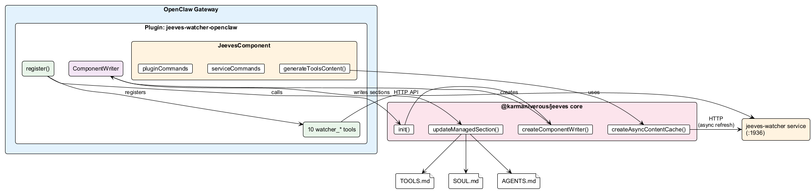

# OpenClaw Integration Guide

The `@karmaniverous/jeeves-watcher-openclaw` plugin gives your OpenClaw agent access to jeeves-watcher's semantic search, metadata enrichment, and management capabilities.

## Installation

The plugin is a standard OpenClaw plugin with no installer of its own. On a Jeeves box, `jeeves install` (from [`@karmaniverous/jeeves`](https://www.npmjs.com/package/@karmaniverous/jeeves) 0.6+) installs it and writes its config:

```bash
jeeves install watcher --config-root /srv/jeeves/config
```

Or install it directly with the OpenClaw CLI and set the config yourself:

```bash
openclaw plugins install npm:@karmaniverous/jeeves-watcher-openclaw@<version> --pin --accept-capabilities
```

The plugin registers an always-in-context rule set through OpenClaw's `before_prompt_build` hook, so it needs `plugins.entries.jeeves-watcher-openclaw.hooks.allowConversationAccess: true`. `jeeves install` / `jeeves update` grant this automatically (the hook is declared in `package.json` under `jeeves.conversationHooks`).

Restart the OpenClaw gateway to apply changes.

## Configuration

Plugin config lives in `openclaw.json` under `plugins.entries.jeeves-watcher-openclaw.config`:

```json
{
  "apiUrl": "http://127.0.0.1:1936",
  "configRoot": "/srv/jeeves/config"
}
```

- **`apiUrl`**: jeeves-watcher API base URL (default: `http://127.0.0.1:1936`; env fallback `JEEVES_WATCHER_URL`).
- **`configRoot`**: platform config root path, used by `@karmaniverous/jeeves` core to derive `{configRoot}/jeeves-watcher/`. **No default.** Set it in plugin config or via the `JEEVES_CONFIG_ROOT` env var.

`configRoot` is resolved lazily. The plugin always registers, even before its config is written (`openclaw plugins install` activates a plugin before `jeeves install` writes `plugins.entries.<id>.config`). While `configRoot` is unset the plugin logs one warning at registration. Gating is per call: only invocations that actually read `configRoot` are gated. Today that is exactly `watcher_service` with `action: "install"` (it derives the service config path from `configRoot`); it returns an error naming both ways to set it. Other `watcher_service` actions (`uninstall`, `start`, `stop`, `restart`, `status`) address the OS service by name, and every other tool only calls the watcher HTTP API, so they keep working without `configRoot`. Core is initialized on the first gated call after it resolves.

## Available Tools

### `watcher_status`

Returns service health, uptime, and Qdrant collection statistics. No parameters required.

### `watcher_search`

Semantic search across all indexed documents. Pass a natural-language query and optional filters.

**Parameters:**

- `query` (string, required) — search text
- `limit` (number) — max results (default: 10)
- `offset` (number) — skip N results for pagination
- `filter` (object) — Qdrant filter conditions

### `watcher_enrich`

Set or update metadata on a document by file path.

### `watcher_config`

Query the effective runtime config via JSONPath. Returns the full resolved merged document when no path is provided. Useful for discovering available inference rules, schemas, and runtime values.

**Parameters:**

- `path` (string, optional) — JSONPath expression

### `watcher_validate`

Validate a jeeves-watcher configuration object. Returns validation errors if any.

### `watcher_config_apply`

Apply a new configuration to the running watcher service. Triggers re-evaluation of watched paths and rules.

### `watcher_reindex`

Trigger a scoped reindex of watched files. Supports `rules` (default), `full`, `issues`, `path`, and `prune` scopes. Non-prune scopes return a blast area plan. Live prune returns immediately without a plan.

**Parameters:**

- `scope` (string) — reindex scope (default: `rules`)
- `path` (string | string[]) — target path(s) for `path` scope
- `dryRun` (boolean) — compute plan without executing

### `watcher_walk`

Walk watched filesystem paths with glob intersection. Returns matching file paths from all configured watch roots.

**Parameters:**

- `globs` (string[], required) — glob patterns to intersect with watch paths

### `watcher_scan`

Filter-only point query without vector search. Returns metadata for points matching a Qdrant filter. Use for structural queries: file enumeration, staleness checks, domain listing, counts.

**Parameters:**

- `filter` (object, required) — Qdrant filter object
- `limit` (number) — page size (default: 100, max: 1000)
- `cursor` (string) — opaque cursor from previous response for pagination
- `fields` (string[]) — payload fields to return (projection)
- `countOnly` (boolean) — if true, return `{ count }` instead of points

### `watcher_issues`

List current indexing issues — files that failed extraction, embedding errors, etc.

### `watcher_service`

Manage the watcher background service (install, uninstall, start, stop, restart, status).

**Parameters:**

- `action` (string, required) — one of: `install`, `uninstall`, `start`, `stop`, `restart`, `status`

## Architecture



## Jeeves Platform Integration

The plugin builds on [`@karmaniverous/jeeves`](https://www.npmjs.com/package/@karmaniverous/jeeves) 0.6 (the static-content core). It writes **no** workspace files and starts no timers:

- **Always-in-context rules**: the watcher escalation, scan-first and search-first rules and score guidance are injected on every turn via `before_prompt_build` (`registerPromptContext`). They replace the v0.x TOOLS.md `## Watcher` section.
- **Live state**: served by tools (`watcher_status`, `watcher_config`) rather than a refreshed file.
- **Skill**: `jeeves-watcher` ships in the package and is declared in `openclaw.plugin.json` (`skills`).
- **Static platform content** (SOUL.md / AGENTS.md blocks) is rendered only by `jeeves install`.

### Version Control (VCS) Tools

### `watcher_vcs_status`

Get version tracking health: enabled state, tracked roots, remote status, last activity. No parameters required.

### `watcher_vcs_history`

Query change history by path or glob with optional date range.

**Parameters:**

- `glob` (string, required) — path or glob pattern to query history for
- `since` (string) — start date (ISO 8601 or date string)
- `until` (string) — end date (ISO 8601 or date string)
- `limit` (number) — maximum number of history entries to return

### `watcher_vcs_show`

Retrieve file content at a specific version.

**Parameters:**

- `path` (string, required) — file path to retrieve
- `commit` (string, required) — version identifier

### `watcher_vcs_diff`

Show what changed between two versions, or between a version and current.

**Parameters:**

- `glob` (string, required) — path or glob pattern to diff
- `commit` (string, required) — start version identifier
- `commitEnd` (string) — end version identifier (defaults to current if omitted)

### `watcher_vcs_revert`

Undo changes by restoring files to a specific version.

**Parameters:**

- `glob` (string, required) — path or glob pattern to revert
- `commit` (string, required) — version to restore files to
- `existingOnly` (boolean) — when true, only revert files that currently exist (skip deleted files)

### `watcher_vcs_exclude`

Exclude or re-include paths from version tracking.

**Parameters:**

- `glob` (string, required) — glob pattern to exclude or re-include
- `root` (string) — tracked root to target (defaults to auto-detect)
- `remove` (boolean) — when true, remove the exclusion rule (re-include the path)

### `watcher_vcs_check`

Check whether a path is excluded from version tracking and why.

**Parameters:**

- `path` (string, required) — file path to check exclusion status for

## Example Usage Patterns

### Search for relevant documents

> "Search the watcher for documents about authentication configuration"

The agent calls `watcher_search` with the query and returns matching document chunks with their source paths and metadata.

### Check service health

> "Is the watcher service running? How many documents are indexed?"

The agent calls `watcher_status` and reports uptime, health, and collection point count.

### Investigate indexing problems

> "Are there any files that failed to index?"

The agent calls `watcher_issues` and summarizes any errors or warnings.

### Reindex after config change

> "I updated the watcher config — please reindex everything"

The agent calls `watcher_config_apply` (if a new config is provided) followed by `watcher_reindex`.
