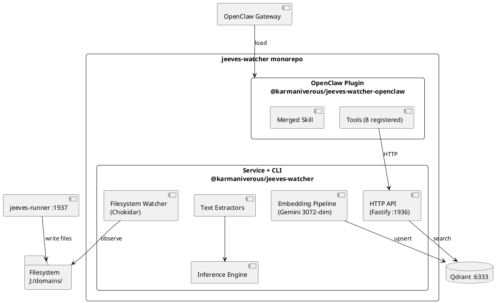
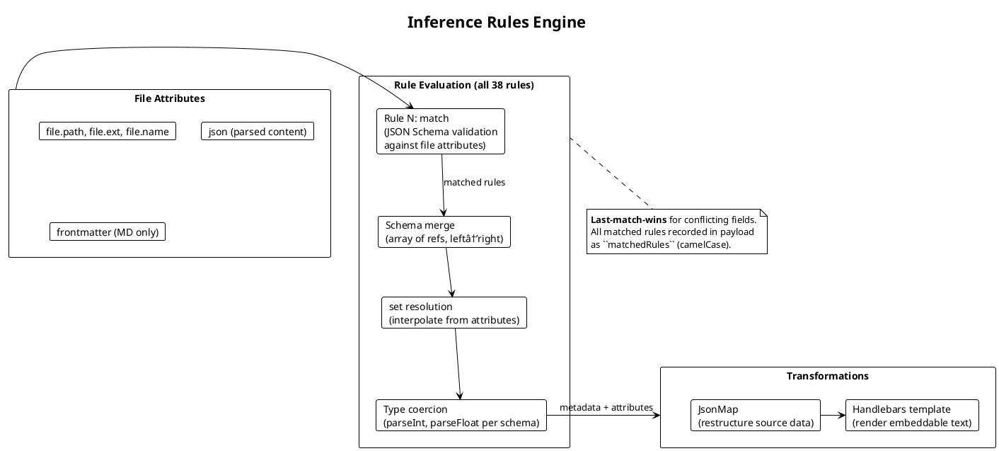
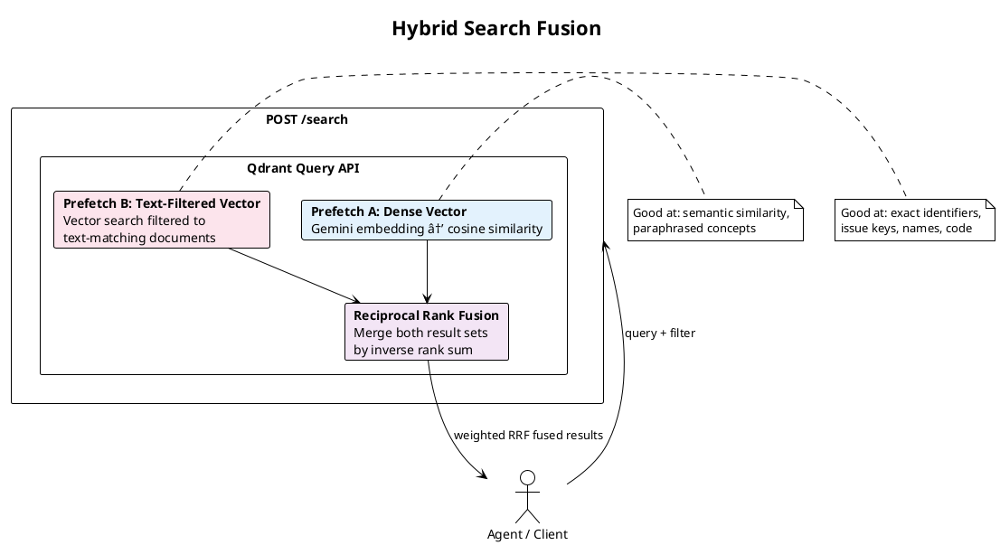
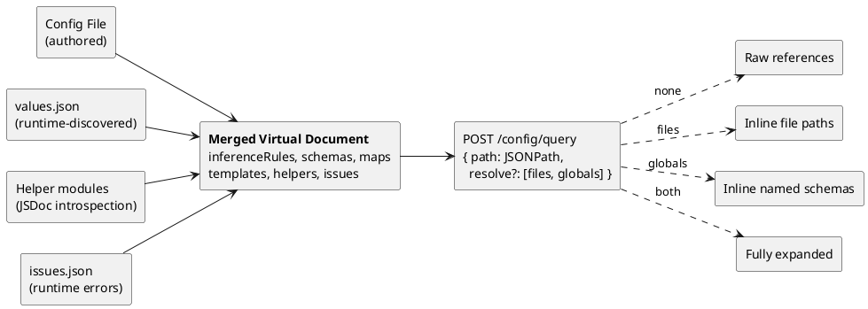
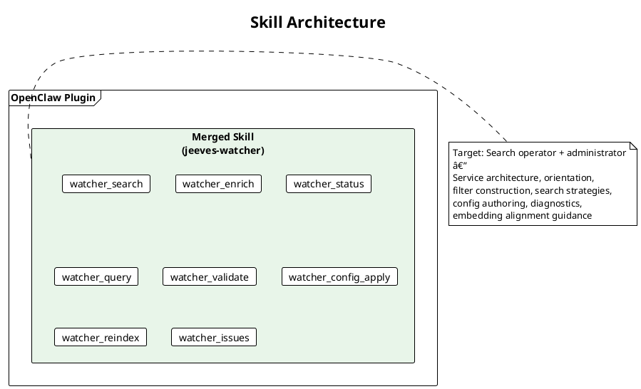
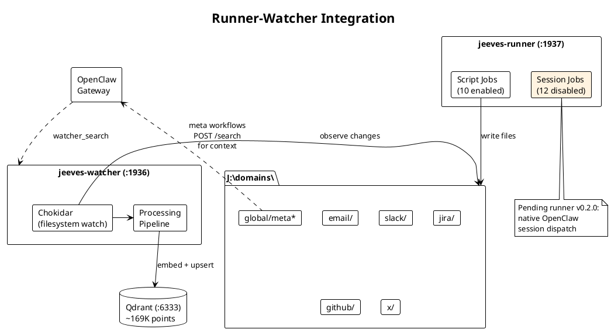

# jeeves-watcher — Product Specification

**Repository:** https://github.com/karmaniverous/jeeves-watcher  
**Packages:**

| Package | Current Version | Description |
|---------|----------------|-------------|
| `@karmaniverous/jeeves-watcher` | 0.6.9 | Service + CLI |
| `@karmaniverous/jeeves-watcher-openclaw` | 0.4.2 | OpenClaw plugin |

---

## Overview

jeeves-watcher is a Node.js service that monitors filesystem directories and maintains a synchronized Qdrant vector store of document content. It extracts text from multiple formats, generates embeddings via Google Gemini, applies configurable inference rules for metadata classification, and exposes a semantic search API.

**Core capabilities:**
- Filesystem watching with configurable paths and ignore patterns
- Multi-format text extraction (JSON, Markdown, HTML, PDF, DOCX, plaintext)
- Automatic embedding and vector store synchronization
- Config-driven metadata inference with JSON Schema validation
- JSONPath query interface over merged config + runtime state
- HTTP API for search, enrichment, config management, and diagnostics
- OpenClaw plugin with merged search, discovery, and administration skill

**Target use case:** Personal knowledge management systems, document archives, RAG pipelines, and development environments that need semantic search over heterogeneous file collections.

---

## Vision

jeeves-watcher aims to be the simplest production-ready semantic indexing layer for filesystem-based knowledge bases.

**The bootstrapping story:** The OpenClaw plugin carries a skill — a static document that teaches an agent everything it needs to bring the watcher into existence. A user installs the plugin package. On next session start, their agent reads the skill and *takes over*: it checks for prerequisites (Node.js, Qdrant), installs the service if missing, authors an initial config tailored to the user's workspace, starts the service, and verifies health — all while prompting the user through decisions only a human can make (which directories to watch, what domains to define, which embedding provider to use).

This is a capability that only exists in an agent-plugin-skill architecture like OpenClaw's. Traditional software ships a README and hopes the user follows it. Here, the documentation is *executable by the agent*. The plugin doesn't just provide tools — it provides the knowledge to bootstrap its own infrastructure. The skill is the installer, the configuration wizard, and the operations manual, unified in a single document that an AI agent reads and acts on proactively.

The plugin complements OpenClaw's built-in memory-core rather than replacing it. Memory-core handles curated memory (MEMORY.md, daily notes) with hybrid search, MMR diversity, and temporal decay. The watcher plugin adds broad archive search across the entire indexed filesystem. The skill teaches the escalation pattern: start with memory for personal context, escalate to the watcher archive when broader search is needed. The skill also offers to align memory-core's embedding model with the watcher's (Gemini `gemini-embedding-001`) for consistent vector quality across both systems.

**Guiding principles:**
1. **Filesystem as source of truth** — Files own content; metadata enriches but never replaces
2. **Config-driven metadata** — Inference rules are data, not code
3. **Transparent operation** — Introspectable config, queryable state, explicit error tracking
4. **Zero vendor lock-in** — Open formats (JSON, Markdown), standard protocols (HTTP, Qdrant)
5. **Agent-first design** — Built for AI agents to discover, query, and enrich autonomously
6. **Skill as bootstrap** — The plugin skill is the right size to do the job, proactively driving configuration rather than waiting to be asked

**Long-term direction:**
- Streaming reindex with progress events
- Embedded deployment mode (library use, not just service)
- Multi-language embedding support
- Incremental schema evolution tracking

---

## Current Version: 0.6.9 / 0.4.2

### Architecture

**Data flow:**
1. **Watch** — Chokidar monitors configured paths for file changes
2. **Extract** — Format-specific extractors produce plain text
3. **Infer** — Inference rules match files and derive metadata
4. **Transform** — Optional JsonMap + Handlebars pipeline structures content
5. **Embed** — Gemini generates vector embeddings
6. **Upsert** — Qdrant point created/updated with vector + metadata payload

```plantuml
@startuml
title Processing Pipeline
!theme plain
skinparam backgroundColor white
skinparam activityBorderColor #333
skinparam activityBackgroundColor #f5f5f5

|Filesystem|
start
:File change detected;
note right: Chokidar event\n(add / change / unlink)

|Extraction|
:Read file content;
:Select extractor by format;
note right
  JSON · Markdown · HTML
  PDF · DOCX · Plaintext
  Jira ADF (custom)
end note
:Produce **text** + **json** + **frontmatter**;

|Inference|
:Evaluate rules against file attributes;
:Collect all matching rules\n(last-match-wins for field conflicts);
:Merge schema arrays (left-to-right);
:Resolve **set** expressions\nagainst file attributes;
:Validate metadata against\nmerged JSON Schema;

|Transformation|
if (Rule has JsonMap?) then (yes)
  :Apply JsonMap transform\n(restructure source data);
else (no)
endif
if (Rule has Handlebars template?) then (yes)
  :Render template\n(produce embeddable text);
else (no)
  :Use extracted text as-is;
endif

|Embedding|
:Chunk text\n(RecursiveCharacterTextSplitter\n1000 tokens, 200 overlap);
:Generate vectors via\nGemini gemini-embedding-001\n(3072 dimensions);

|Vector Store|
:Upsert points to Qdrant\n(vector + system fields + rule metadata);
stop

@enduml
```



**Two sources of truth:**
- **Filesystem** — Content (canonical) with inference rules for metadata extraction
- **Qdrant** — Derived index (fully rebuildable)

**Monorepo structure:**
```
jeeves-watcher/
├── packages/
│   ├── service/          # Core service + API + CLI
│   └── openclaw/         # OpenClaw plugin + skills
```



### Service Components

#### Filesystem Watcher
- **Implementation:** Chokidar with debounced event handling
- **Watch paths:** Configurable glob patterns (e.g., `j:/domains/**/*.{md,json,txt}`)
- **Ignore patterns:** `.gitignore` support + explicit excludes (node_modules, .git, etc.)
- **Event types:** add, change, unlink → corresponding vector store operations

#### Text Extractors
- **JSON:** Flattened key-value pairs or JsonMap-transformed structure
- **Markdown:** Parsed AST with frontmatter extraction
- **HTML:** Cleaned text via Cheerio
- **PDF:** Text extraction via unpdf
- **DOCX:** Mammoth conversion to Markdown
- **Plaintext:** Direct read with BOM stripping
- **Jira ADF:** Handled via `{{adfToMarkdown}}` Handlebars helper in content templates (not a standalone extractor)

Each extractor produces:
- `text` — embeddable content
- `json` — structured source data (for JsonMap transforms)
- `frontmatter` — key-value metadata (Markdown only)

#### Inference Rules Engine

**Rule structure:**
```json
{
  "name": "jira-issue",
  "description": "Jira issue records",
  "match": {
    "type": "object",
    "properties": {
      "file.path": { "type": "string", "glob": "j:/domains/jira/**/issue/*.json" }
    }
  },
  "schema": ["base", { "type": "object", "properties": { "issue_key": { "type": "string", "set": "{{json.key}}" } } }],
  "map": "jira-issue",
  "template": "jira-issue"
}
```

**Matching:** JSON Schema validation against file attributes (`file.path`, `file.ext`, `file.name`, `file.dir`, plus extractor outputs)

**Schema merging:** Array of references (named globals or inline objects) merged left-to-right. Each property must declare `type`; additional keywords: `description`, `uiHint`, `enum`, `set` (custom extraction expression).

**Metadata extraction:** `set` expressions use Handlebars template syntax (`{{...}}`). Simple property access: `{{json.key}}`, `{{frontmatter.title}}`, `{{file.name}}`. Handlebars helpers are available for transformation: `{{toUnix json.fields.created}}` (ISO → unix seconds), `{{join json.labels ", "}}`, `{{lowercase json.status}}`, etc. Custom helpers from `templateHelpers` config are also available with namespace prefixing. The template context includes `json.*`, `frontmatter.*`, and `file.*` attributes. Type coercion applies after template resolution: `"type": "integer"` → `parseInt()`, `"type": "number"` → `parseFloat()`. Values resolving to empty string, `NaN`, or `null` are omitted from metadata.

**Transformations:**
- **JsonMap:** Pre-template data restructuring (e.g., flatten Jira API response)
- **Handlebars template:** Render structured text for embedding (e.g., "Issue WEB-123: {{summary}}")

**Multiple rule matching:** Last-match-wins for overlapping field assignments. All matched rules recorded in `matchedRules` payload field.



#### Config Schema

**Zod-validated schema with these top-level keys:**

| Key | Type | Description |
|-----|------|-------------|
| `description` | string | Deployment's organizational strategy |
| `schemas` | object | Global named schema definitions |
| `watch` | object | Filesystem watch config (paths, ignored, debounce) |
| `configWatch` | object | Config file watch settings: `enabled` (bool), `debounceMs` (number), `reindex` (`"issues"` or `"full"`, scope triggered on config change) |
| `embedding` | object | Gemini config (model, dimensions, rate limits) |
| `vectorStore` | object | Qdrant connection (url, collection, distance metric) |
| `metadataDir` | string | Directory for `.meta.json` sidecars |
| `stateDir` | string | Directory for `issues.json` + `values.json` (defaults to metadataDir) |
| `inferenceRules` | array | Rule definitions |
| `maps` | object | Named JsonMap transforms (inline or file path) |
| `templates` | object | Named Handlebars templates (inline or file path) |
| `mapHelpers` | object | Custom JsonMap lib functions (path + description) |
| `templateHelpers` | object | Custom Handlebars helpers (path + description) |
| `reindex` | object | Reindex config (callbackUrl) |
| `slots` | object | Named Qdrant filter patterns for skill behaviors *(Retained in schema for backward compatibility. Not used by the current plugin. May be removed in a future version.)* |
| `search` | object | Search config (scoreThresholds) |
| `api` | object | API server config (host, port) |
| `logging` | object | Logging config (level, pretty) |

**Environment variable substitution:** `${ENV_VAR}` syntax in string values.

**Config watching:** Debounced file watch with atomic reload (validate before apply). Invalid config edits are logged and rejected; service continues on previous config.

#### Helper System

**Namespace prefixing:** Helper registration uses config key as namespace. A mapHelper named `slack` exporting `extractParticipants` registers as `slack_extractParticipants` in JsonMap lib.

**JSDoc introspection:** Helpers are loaded and introspected at startup:
- Module-level description from `@module` or config `description` field
- Export-level descriptions from individual JSDoc comments
- Results injected into merged virtual document under `mapHelpers.<name>.exports` and `templateHelpers.<name>.exports`

**Helpers referenced in maps/templates by prefixed name:**
```handlebars
{{slack_formatChannel channelId}}
```

#### Embedding Pipeline

**Provider:** Google Gemini (`gemini-embedding-001`)
**Dimensions:** 3072 (supports Matryoshka truncation to 1536/768)
**Chunking:** RecursiveCharacterTextSplitter (1000 tokens, 200 overlap)
**Rate limiting:** 300 requests/minute (default), concurrency 5
**Retry logic:** Exponential backoff for transient API errors
**Cost:** ~$0.15 per million tokens

Each chunk becomes a Qdrant point with:
- Vector from embedding
- Payload with system fields + rule-derived metadata

**System payload fields (always present):**
- `file_path` — source file absolute path
- `chunk_index` / `total_chunks` — position within document
- `chunk_text` — embedded text content
- `content_hash` — SHA-256 of full document
- `matchedRules` — array of rule names that produced metadata
- `line_start` / `line_end` — 1-indexed line numbers for the chunk's position in the source file
- `created_at` / `modified_at` — Unix timestamps (seconds) from filesystem stat (`birthtime` / `mtime`)

#### Qdrant Connection Resilience

**Problem solved (v0.6.4):** Undici HTTP keep-alive connections to Qdrant went stale during slow embedding calls (Google Gemini p99 ~8s), causing ECONNRESET on subsequent upsert operations.

**Solution:** Fresh `QdrantClient` instance per write operation. Read operations (search, status) can reuse clients safely since they complete quickly.

**Case-insensitive glob matching (v0.6.4):** The `glob` keyword in AJV inference rule matching uses `nocase: true` (picomatch option) for Windows path case-insensitivity.

#### Hybrid Search (Vector + Full-Text Fusion)

**Added in v0.6.8.** Hybrid search combining dense vector similarity with text-filtered vector search, merged via weighted Reciprocal Rank Fusion (RRF). Solves the problem of pure vector search being poor at matching exact identifiers (issue keys, names, channel IDs, error messages, code snippets).

**Full-text index:** Qdrant payload index on `chunk_text` field (word tokenizer, min token length 2). Created automatically in `ensureCollection()` — no re-embedding required.

**Search-time fusion:** When `search.hybrid.enabled: true`, the search endpoint uses Qdrant's Query API:
- Prefetch A: Dense vector similarity search (existing behavior)
- Prefetch B: Full-text BM25 match against `chunk_text`
- Fusion: RRF merges both result sets
- Metadata filters apply uniformly to both branches



**Config:**
```typescript
search: {
  hybrid?: {
    enabled: boolean;          // Default: false
    textWeight?: number;       // Default: 0.3 (weight for text results in RRF fusion)
  }
}
```

**Impact:** <10ms added latency (negligible vs 200-500ms Gemini API call). Tens of MB storage for inverted index. Transparent to API consumers — no surface changes.

#### Issues File

**Path:** `<stateDir>/issues.json`

**Schema:**
```typescript
{
  [filePath: string]: {
    rule: string;              // Rule being applied when error occurred
    error: string;             // Human-readable message
    errorType: 'type_collision' | 'interpolation_error';
    timestamp: string;         // ISO-8601
    attempts: number;          // Consecutive failure count
  }
}
```

**Lifecycle:**
- Created when file processing fails
- Updated on repeated failures (increments attempts, updates timestamp)
- Cleared when file successfully re-processes
- Bulk cleared on full reindex

**Error types:**
- `type_collision` — Multiple rules declare same field with incompatible types
- `interpolation_error` — `set` expression failed to resolve

#### Values Index

**Path:** `<stateDir>/values.json`

**Schema:**
```typescript
{
  [ruleName: string]: {
    [fieldName: string]: string[]  // Distinct values observed
  }
}
```

**Purpose:** Runtime-discovered distinct values for fields without static `enum` in schema. Used for filter value enumeration in query planning.

**Update strategy:** Incremental append on successful embedding. Cleared and rebuilt on full reindex only.

#### Merged Virtual Document

**Construction:** Runtime assembly combining:
- Authored config (rules, schemas, maps, templates, helpers)
- Runtime values index (`inferenceRules[*].values`)
- Helper exports with JSDoc descriptions
- Current issues

**Query interface:** `POST /config/query` with JSONPath + optional `resolve` parameter.

**Resolve modes:**
- No resolve (default): Raw config with references intact
- `resolve: ["files"]`: Inline file path references
- `resolve: ["globals"]`: Inline named schema references
- `resolve: ["files","globals"]`: Fully expanded

**Use cases:**
- Orientation: `$.inferenceRules[*].['name','description']` — no resolve needed
- Schema inspection: `$.inferenceRules[?(@.name=='jira-issue')].schema` with full resolve
- Value enumeration: `$.inferenceRules[?(@.name=='jira-issue')].values.status`
- Helper discovery: `$.mapHelpers` / `$.templateHelpers`
- Diagnostics: `$.issues`



### HTTP API

**Server:** Fastify on configurable host:port (default 127.0.0.1:1936)

#### Endpoints

**`GET /status`**
- Health check with uptime, collection stats, reindex status
- Returns: `{ status, uptime, collection: { name, pointCount, dimensions }, reindex?: { active, scope, startedAt } }`

**`POST /search`**
- Semantic search with optional metadata filtering
- Body: `{ query: string, limit?: number, offset?: number, filter?: QdrantFilter }`
- Returns: Array of `{ id, score, payload }` results
- Filter parameter: Native Qdrant filter object (pass-through)

**`POST /metadata`**
- Enrich document metadata
- Body: `{ path: string, metadata: object }`
- Validates against matched rule schemas
- Returns: `{ success: true }` or `{ error, violations: [...] }`

**`POST /reindex`**
- Synchronous full reindex (blocks until complete)
- Returns: `{ ok: true, filesIndexed: number }`

**`POST /config-reindex`**
- Asynchronous reindex with scope control
- Body: `{ scope: 'issues' | 'full' }`
- `issues` (rules scope): Re-apply inference rules, no re-embedding
- `full`: Re-extract + re-embed + re-apply rules
- Returns: `{ status: 'started', scope }`

**`POST /rebuild-metadata`**
- Internal/diagnostic endpoint (not exposed as plugin tool)
- Rebuilds vector store metadata from sidecar files
- Body: `{ collectionName?: string }`

**`GET /issues`**
- Returns current runtime issues
- Returns: `{ count: number, issues: { [path]: IssueRecord } }`

**`GET /config/schema`**
- Returns JSON Schema for config validation
- Useful for editor autocomplete/validation

**`POST /config/match`**
- Test which rules would match a given file path
- Body: `{ path: string }`
- Returns: `{ matchedRules: string[], watched: boolean }`

**`POST /config/query`**
- JSONPath query against merged virtual document
- Body: `{ path: string, resolve?: ('files'|'globals')[] }`
- Returns: `{ result: unknown[], count: number }`

**`POST /rules/register`**
- Register virtual inference rules from external consumers
- Body: `{ source: string, rules: InferenceRule[] }`
- Rules are tagged with the `source` identifier, merge into the inference pipeline after config rules
- Virtual rules use last-match-wins for overlapping fields (take precedence over config rules)
- Stored in-memory only (not persisted); survive config reloads but NOT service restarts
- Idempotent: re-registering with the same source replaces previous rules

**`DELETE /rules/unregister`**
- Remove virtual rules by source
- Body: `{ source: string }`
- Also available as `DELETE /rules/unregister/:source`
- Points created by virtual rules remain in Qdrant

**`POST /rules/reapply`**
- Re-derive metadata for files matching registered rules without re-embedding
- Useful after virtual rule registration to update metadata on existing points

**`POST /points/delete`**
- Delete points matching a Qdrant filter
- Body: `{ filter: QdrantFilter }`
- Returns: `{ deleted: number }`

**`POST /config/validate`**
- Validate config and optionally test file paths
- Body: `{ config?: object, testPaths?: string[] }`
- Partial configs merge by rule name
- Returns: `{ valid: boolean, errors?: ValidationError[], testResults?: TestResult[] }`
- TestResult includes: `{ path, matchedRules, metadata, error? }`

**`POST /config/apply`**
- Atomic config update: validate → write → reload → trigger reindex
- Body: `{ config: object }`
- Returns: `{ applied: true, reindexTriggered: boolean, scope }`
- Uses `configWatch.reindex` setting for scope

#### Reindex Completion Callback

When `reindex.callbackUrl` is configured, the service fires HTTP POST on reindex completion:

**Payload:**
```json
{
  "scope": "issues" | "full",
  "filesProcessed": 123,
  "durationMs": 45000,
  "errors": []
}
```

**Retry:** 3 attempts with exponential backoff (1s, 2s, 4s). Failures logged, never block service.

### CLI

**Binary:** `jeeves-watcher` (installed to PATH via npm global or local bin)

**Commands:**

| Command | Description |
|---------|-------------|
| `start [-c <config>]` | Start the service |
| `validate [-c <config>]` | Validate config file |
| `init [-o <path>]` | Generate starter config |
| `status [--port <n>]` | Query `/status` endpoint |
| `search <query> [--limit N] [--filter '{...}'] [--port <n>]` | Execute search |
| `enrich --path <path> --metadata '{...}' [--port <n>]` | Enrich metadata |
| `reindex [--port <n>]` | Trigger sync full reindex |
| `config-reindex [--scope issues\|full] [--port <n>]` | Trigger async reindex |
| `rebuild-metadata [--port <n>]` | Rebuild metadata from sidecars |
| `query <jsonpath> [--resolve files,globals] [--port <n>]` | Query merged doc |
| `issues [--port <n>]` | Show runtime issues |
| `helpers [--port <n>]` | List loaded helpers |
| `config-apply --file <path> [--port <n>]` | Apply config atomically |
| `service install\|uninstall\|start\|stop\|restart` | NSSM service management (Windows) |

**Version:** CLI reads version dynamically from package.json (fixed in v0.6.8). Default port display corrected from 3456 to 1936 in v0.6.9.

### OpenClaw Plugin

**Package:** `@karmaniverous/jeeves-watcher-openclaw`

**Manifest:** `openclaw.plugin.json`

The manifest ships without `kind: "memory"` — the plugin is a pure extension that adds watcher tools alongside memory-core.

```json
{
  "id": "jeeves-watcher-openclaw",
  "name": "Jeeves Watcher",
  "description": "Semantic search and metadata enrichment via a jeeves-watcher instance.",
  "version": "0.4.1",
  "skills": [
    "dist/skills/jeeves-watcher"
  ],
  "configSchema": {
    "type": "object",
    "properties": {
      "apiUrl": { "type": "string", "default": "http://127.0.0.1:1936" }
    }
  }
}
```

#### Tools

The plugin provides **8 `watcher_*` tools**. Memory is handled by OpenClaw's built-in memory-core plugin.

All tools registered with `{ optional: true }` — users must allowlist via `agents[].tools.allow`.

**`watcher_status`**
- Get service health, uptime, collection stats, reindex status
- No parameters

**`watcher_search`**
- Semantic search with optional filters
- Parameters: `query` (string, required), `limit` (number), `offset` (number), `filter` (object)

**`watcher_enrich`**
- Set/update document metadata
- Parameters: `path` (string, required), `metadata` (object, required)

**`watcher_query`**
- JSONPath query against merged virtual document
- Parameters: `path` (string, required), `resolve` (array of "files"/"globals")

**`watcher_validate`**
- Validate config with optional path testing
- Parameters: `config` (object), `testPaths` (string[])

**`watcher_config_apply`**
- Apply config atomically
- Parameters: `config` (object, required)

**`watcher_reindex`**
- Trigger reindex
- Parameters: `scope` (enum: "issues" | "full")

**`watcher_issues`**
- Get runtime issues
- No parameters

#### Error Handling

All `watcher_*` tools detect connection failures and return actionable error messages including the attempted URL, a suggestion to start the service, and how to configure a non-default port via `plugins.entries.jeeves-watcher.config.apiUrl` in `openclaw.json`.

#### Skill

**Merged skill architecture:** A single `jeeves-watcher` skill covers search, discovery, and administration.



**Build pipeline:**
- Source: `skills/jeeves-watcher/SKILL.md` (static markdown, no compilation)
- Build script copies to `dist/skills/jeeves-watcher/SKILL.md`
- Output: `dist/skills/jeeves-watcher/SKILL.md`

**Skill: jeeves-watcher (merged)**

Target persona: Search operator + instance administrator

**Design principles:**

- **Right-sized context.** The skill should be as long as it needs to be. A few dozen lines of skill context is negligible cost; don't sacrifice clarity for brevity.
- **Proactive posture.** The skill instructs the agent to *drive* configuration, not wait to be asked. On load, the agent assesses state (is the watcher running? is the config present? is the memory slot claimed?) and prompts the user through whatever is missing. The user should never have to ask "now what?" — the agent tells them.

Content:
1. **Service Architecture** — HTTP API, port, health check, direct access
2. **Theory of operation** — What the archive is, when to search, when not to
3. **Memory → Archive Escalation** — Memory-core handles curated memory; escalate to `watcher_search` when broader archive search is needed
4. **Quick Start** — Session-start orientation
5. **Bootstrap (First Session)** — Proactive orientation sequence: health check, deployment discovery, context caching, readiness report
6. **Embedding Alignment** — Proactive guidance to align memory-core's embedding model with the watcher's (Gemini `gemini-embedding-001`) for consistent vector quality
7. **Tools** — All 8 `watcher_*` tools with response shapes
8. **Qdrant filter syntax** — Native filter construction (must/should/must_not, match.value vs match.text)
9. **Search result shape** — System fields, chunk grouping, metadata interpretation
10. **Orientation pattern** — Session-start queries for deployment context and rule enumeration
11. **JSONPath patterns** — Common query patterns for orientation and discovery
12. **Query planning** — Schema discovery, uiHint → filter mapping
13. **Search execution** — Limit guidance, score interpretation, when to filter
14. **Post-processing** — Result interpretation and grouping
15. **Config authoring** — Rule structure, schema arrays, set expressions, helpers
16. **Diagnostics** — Escalation path (status → issues → logs), error categories
17. **Helper management** — Namespace prefixing, JSDoc introspection
18. **Enrichment patterns** — When and how to use watcher_enrich
19. **CLI fallbacks** — Manual operations when API is down

#### Installation

```bash
npx @karmaniverous/jeeves-watcher-openclaw install
```

The CLI installer:
1. Copies plugin files to the OpenClaw extensions directory
2. Patches `openclaw.json` (enables plugin, sets `apiUrl` if watcher is on non-default port)

```bash
npx @karmaniverous/jeeves-watcher-openclaw uninstall
```

Uninstaller removes plugin files and config entry.

**Non-default port:** If the watcher runs on a port other than 1936, set `apiUrl` in the plugin config:
```json
{
  "plugins": {
    "entries": {
      "jeeves-watcher-openclaw": {
        "config": {
          "apiUrl": "http://127.0.0.1:1936"
        }
      }
    }
  }
}
```

After install, restart the OpenClaw gateway to load the plugin.

### Deployment Model

**Production (Windows):**
- Service manager: NSSM (Non-Sucking Service Manager)
- CLI command: `jeeves-watcher service install`
- Logs: Stdout/stderr redirected to `<stateDir>/watcher-{stdout,stderr}.log`
- Start mode: Automatic
- Recovery: Restart on failure

**Production (Linux):**
- Service manager: systemd
- Unit file: `/etc/systemd/system/jeeves-watcher.service`
- Start mode: `enabled`
- Logs: journalctl

**Development:**
- Direct invocation: `jeeves-watcher start -c config.json`
- No service wrapper

### Known Issues

**Open:**
- [#33](https://github.com/karmaniverous/jeeves-watcher/issues/33) — Date fields inconsistent across domains (need normalized unix timestamps via `{{toUnix ...}}` Handlebars helper in `set` expressions — infrastructure implemented in v0.6.8, config migration pending; targeted for v0.7.0)
- `domain` vs `domains` convention mismatch — all rules now use `domains` (plural array) but older indexed points have `domain` (singular string). jeeves-server browse filter expects `domain`. Needs alignment.

**Closed:**
- [#24](https://github.com/karmaniverous/jeeves-watcher/issues/24) — Filesystem date metadata (FIXED v0.6.0 — `created_at`/`modified_at` from fs.stat)
- [#34](https://github.com/karmaniverous/jeeves-watcher/issues/34) — Config introspection API (FIXED — merged virtual document + /config/query)
- [#22](https://github.com/karmaniverous/jeeves-watcher/issues/22) — No pagination on /search (FIXED — offset param added)
- [#15](https://github.com/karmaniverous/jeeves-watcher/issues/15) — Shebang in ESM CLI output (fixed in PR #16)
- CLI version hardcoded `0.7.0` (FIXED v0.6.8 — reads from package.json)

---

## Next Version: 0.7.0 / 0.5.0

**Target:**

| Package | Current | Target |
|---------|---------|--------|
| `@karmaniverous/jeeves-watcher` | 0.6.9 | 0.7.0 |
| `@karmaniverous/jeeves-watcher-openclaw` | 0.4.1 | 0.5.0 |

**Remaining work:** Date normalization config migration (applying `{{toUnix ...}}` helpers to production inference rules), `render` block and `renderDoc` helper (structured frontmatter/Markdown rendering driven by rule-level `render` config, mutually exclusive with `template`), deployment cleanup, and implementing **Dynamic System Prompt Injection** with a **Caching Architecture**. Port migration confirmed (on 1936). Embedding concurrency already restored to 5.

This section describes changes from the current versions. Only deltas are documented here; unchanged features remain as specified in Current Version.

*Note: All previously listed implemented features (hybrid search, Handlebars `set` expressions, filesystem date metadata, line offsets, `domains` migration, merged skill, virtual rules API, points deletion API, provider branding) have been moved to Current Version. Memory slot takeover was implemented and subsequently removed in v0.4.0.*

---

### Dynamic System Prompt Injection (OpenClaw Plugin)

**Problem:** LLM agents (especially those based on coding personas) have a strong, identity-level bias toward filesystem tools (\exec\, \
ead\, \grep\, \Get-ChildItem\) when asked to find documents or information. Even when \watcher_search\ is available and a written rule in \MEMORY.md\ dictates its use, the agent often defaults to slow, token-heavy filesystem traversal instead of fast, semantic vector search.

**Solution:** The \@karmaniverous/jeeves-watcher-openclaw\ plugin will register an \gent:bootstrap\ hook to inject a dynamic, just-in-time "Watcher Menu" directly into the agent's system prompt on every turn. 

**Design:**
When OpenClaw assembles the system prompt, the plugin's hook intercepts the bootstrap payload. Because OpenClaw restricts bootstrap files to a strict union of known filenames, the hook dynamically injects the generated 'Watcher Menu' into the `TOOLS.md` file payload in memory. It uses a shared ecosystem pattern: checking for a # Jeeves Platform Tools H1 header. If missing, it prepends the H1 to the file. It then inserts its content under a specific ## Watcher H2 header beneath the H1. This guarantees the LLM sees the watcher's capabilities at the foundational context level, intercepting the tool-selection reasoning before it defaults to `exec`.

The injected content must be entirely platform-agnostic and data-driven, populated dynamically from the watcher's actual runtime state:
1. Hit `GET /status` to retrieve the current point count (demonstrating the scale/value of the index).
2. Hit `POST /config/query` to extract the configured `watch.paths`, `inference.rules`, and `search.scoreThresholds`.
3. Map the active inference rules into a clean markdown menu of - **Name**: Description (translating structural paths into semantic *intent*).
4. Inject this generated text into the `TOOLS.md` bootstrap file payload in memory, safely prepending/appending under the shared # Jeeves Platform Tools H1 and its own ## Watcher H2.

**Example Injected Output:**
\\\markdown
# Semantic Search Index (jeeves-watcher)

This environment includes a semantic search index (\watcher_search\) covering 170,000+ document chunks. 
**Escalation Rule:** Use \memory_search\ for personal operational notes, decisions, and rules. Escalate to \watcher_search\ when memory is thin, or when searching the broader archive (tickets, docs, code). ALWAYS use \watcher_search\ BEFORE filesystem commands (exec, grep) when looking for information that matches the indexed categories below.

## Score Interpretation:
* **Strong:** >= 0.75
* **Relevant:** >= 0.50
* **Noise:** < 0.25

## What's on the menu:
* **github-meta**: GitHub Repository Metadata, active issues, and CI status.
* **jira-issue**: Jira issue records.
* **projects**: Project specifications and documentation.
* *(...dynamically populated from inference rule names & descriptions)*

## Indexed paths:
* \j:/domains/**/*.md\
* \j:/config/**/*.json\
* *(...dynamically populated from watch.paths)*
\\\

**Impact:** This bridges the gap between user intent ("I need a Jira issue") and tool selection ("Jira issues are on the watcher's menu, I should use watcher_search") without requiring the agent to guess file paths or rely on static \MEMORY.md\ rules that may be summarized away during context compaction.

**Caching Architecture:**
To prevent the bootstrap hook from introducing latency on every LLM routing cycle, caching will be applied at two levels:

1. **Plugin-Side Cache:** The plugin will cache the final generated \WATCHER_MENU.md\ string in-memory with a 30s TTL. If the cache is valid, the hook returns immediately, producing **zero network overhead**.
2. **Server-Side Cache (API):** The \jeeves-watcher\ service will add a new \pi.cacheTtlMs\ configuration property (default 30s). A DRY route wrapper (\withCache.ts\) will cache responses in-memory, keyed by HTTP method, URL, and a hash of the request body. This protects expensive read operations (\GET /status\, \POST /config/query\, \GET /config/schema\, \GET /issues\) from any aggressive client, not just the plugin. Mutating endpoints and \POST /search\ remain uncached.

**SKILL.md Refactoring:**
Because critical context is now injected into the system prompt on every turn, several sections of the existing \SKILL.md\ become redundant and will be removed or refactored:
* **Remove the "Orientation Pattern" entirely.** The agent no longer needs to query the API for rules or thresholds at the start of a session; they are handed to it in the system prompt.
* **Remove "Quick Start" Step 1.** The instruction to *"Orient yourself (once per session)"* is obsolete.
* **Promote the "Memory vs Archive Escalation Rule".** Moved from the skill document into the injected prompt so it cannot be lost to context compaction.

### renderDoc Helper and Template Consolidation

**Problem:** The 5 existing Handlebars templates (`jira-issue`, `jira-sprint`, `jira-comment`, `slack-message`, `linkedin-thread`) each independently implement the same structural pattern: metadata fields rendered as `**Key:** value` lines, followed by content sections with headings. Each template tangles two concerns: *structural knowledge* (what a rendered document looks like) and *domain knowledge* (which keys exist and what format they're in). Adding a new domain requires writing a new template from scratch. Changing the output format requires editing all templates identically.

**Solution:** A new `render` key on inference rules, mutually exclusive with `template`. When `render` is present, the engine calls a built-in `renderDoc` helper that dynamically generates YAML frontmatter + structured Markdown from the render config. No Handlebars template authoring required — domain knowledge is expressed as data in the `render` block.

**Design:**

The `render` key is a first-class field on inference rules, validated by Zod as mutually exclusive with `template`. When the inference engine encounters a rule with `render`, it invokes `renderDoc` directly (bypassing the Handlebars template compilation path). The existing `template` system is unchanged and remains available for bespoke rendering needs.

`renderDoc` produces:

1. **YAML frontmatter** — specified keys extracted from source data, properly escaped, nested structure preserved
2. **Structured Markdown body** — sections mapped by key path with configurable heading levels, format-aware rendering via named Handlebars helpers, and automatic heading rebasing

**TypeScript types:**

```typescript
interface RenderConfig {
  frontmatter: string[];
  body: BodySection[];
}

interface BodySection {
  /** Key in template context to render */
  path: string;

  /** Markdown heading level (1–6) */
  heading: number;

  /** Override heading text (default: titlecased path) */
  label?: string;

  /**
   * Format handler — name of a registered Handlebars helper.
   * Called as helper(value, ...formatArgs).
   * Output is treated as Markdown and heading-rebased
   * relative to this section's heading level.
   * Omit for plain text passthrough (no helper call, no rebasing).
   */
  format?: string;

  /** Additional arguments passed to the format helper */
  formatArgs?: unknown[];

  /**
   * If true, path resolves to an array.
   * Each item gets its own sub-heading at heading+1.
   */
  each?: boolean;

  /**
   * Handlebars template for per-item heading text.
   * Context is the array item. Used with each.
   */
  headingTemplate?: string;

  /**
   * Within each item, the key containing renderable content.
   * Used with each. Default: the item itself.
   */
  contentPath?: string;

  /** Key to sort array items by. Used with each. */
  sort?: string;
}
```

**`frontmatter` array:** Keys to extract from the template context. Values are YAML-escaped automatically. Nested objects/arrays are rendered as YAML structure. Keys not present in the source data are omitted. Order follows array order.

**`body` array:** Ordered sections, each producing a Markdown heading + rendered content.

**Format dispatch:** `format` is the name of a registered Handlebars helper. `renderDoc` calls `hbs.helpers[format](value, ...formatArgs)`, treats the output as Markdown, and rebases any headings in the output relative to the section's heading level. This means:
- Built-in helpers work directly: `"format": "adfToMarkdown"`, `"format": "markdownify"`
- Custom helpers registered via `templateHelpers` config are available by their namespaced name
- No hardcoded dispatch table inside `renderDoc` — extensible without code changes
- When `format` is omitted: the value is stringified as plain text (no helper call, no heading rebasing)

**Heading rebasing:** When the format helper produces Markdown containing headings, they are offset so the highest content heading starts one level below the section heading. Example: a section at `heading: 2` (H2) with ADF containing H1 and H2 → content headings become H3 and H4.

**YAML escaping:** Values containing YAML-special characters (`:`, `#`, `"`, `'`, newlines, leading `[{>|*&!%@`) are automatically quoted. Null/undefined values are omitted. Arrays render as YAML flow sequences. Objects render as nested YAML.

**Mutual exclusivity:** Zod validates that `render` and `template` are mutually exclusive on a rule. Rules without either pass through extracted text as-is (unchanged behavior). The existing `template` system remains available for bespoke Handlebars rendering but cannot be combined with `render`.

**Example: Jira issue rule (before → after):**

Before:
```json
{
  "name": "jira-issue",
  "template": "jira-issue",
  "map": "jira-issue",
  "schema": ["base", "jira-common", "jira-issue"]
}
```

After:
```json
{
  "name": "jira-issue",
  "map": "jira-issue",
  "schema": ["base", "jira-common", "jira-issue"],
  "render": {
    "frontmatter": ["key", "issueType", "status", "priority", "project",
                     "assignee", "reporter", "created", "updated"],
    "body": [
      { "path": "summary", "heading": 1 },
      { "path": "description", "heading": 2, "format": "adfToMarkdown" },
      { "path": "acceptanceCriteria", "heading": 2, "label": "Acceptance Criteria", "format": "adfToMarkdown" },
      {
        "path": "comments",
        "heading": 2,
        "label": "Comments",
        "each": true,
        "headingTemplate": "{{author.displayName}} ({{created}})",
        "contentPath": "body",
        "format": "adfToMarkdown",
        "sort": "created"
      }
    ]
  }
}
```

**Example: Slack message rule:**

```json
{
  "name": "slack-message",
  "map": "slack-message",
  "schema": ["base", "slack-message"],
  "render": {
    "frontmatter": ["channelName", "userName", "user", "date", "threadTs", "subtype"],
    "body": [
      { "path": "channelName", "heading": 1, "label": "Slack message in #{{channelName}}" },
      { "path": "text", "heading": 2, "label": "Message" }
    ]
  }
}
```

**Config changes:**
- Old named templates (`jira-issue`, `jira-sprint`, `jira-comment`, `slack-message`, `linkedin-thread`) are removed from the `templates` config object
- Old `.hbs` template files in `J:\config\templates\` are no longer referenced
- Each structured rule replaces `"template": "..."` with a `"render"` block
- The `templates` config key remains in the schema for backward compatibility but may have zero entries in production

**Complexity analysis:** We trade 5 bespoke templates (each tangling structural and domain knowledge) for 5 `render` blocks (pure domain knowledge as data). Structural knowledge is written once in `renderDoc` and shared. Adding a new domain requires no template authoring, and changing the output format requires editing only `renderDoc`. The `format` field's use of named Handlebars helpers means new content formats can be added via `templateHelpers` config without touching service code.

**Positions for future render pipeline:** When shared config lands (server v3.0.0 → shared deps → shared config), the `render` block is already a first-class schema element. The `renderDoc` helper becomes the render engine for the broader ecosystem. No schema migration needed.

## Backlog

**Beyond v0.6.0** — Lightweight future items (title + one-liner):

- **Troubleshooting playbook in deployed admin skill** — Concrete "when X happens, do Y" scenarios (e.g., embedding failures after config change, Qdrant connection loss, reindex stuck). The admin skill has diagnostic categories but no step-by-step resolution paths.
- **Qdrant operational knowledge in deployed admin skill** — Backup/restore, collection management, snapshot creation, capacity monitoring. Currently absent from both deployed skills.
- **Embedding pipeline documentation** — End-to-end description of extractors → chunking → embedding → indexing flow. Useful for debugging pipeline issues and for contributors.
- **Inference rule design patterns** — Guide for authoring rules from scratch: when to use `set` vs `map`, schema design patterns, testing strategies. The admin skill has rule structure but not design guidance.
- **Reindex progress reporting** — Expose files processed / total in the API during reindex operations, so progress isn't a black box.
- **Full-text index status in CLI/status** — Include BM25 text index health in the status endpoint output.
- **Streaming reindex** — WebSocket or SSE progress events for long-running reindexes
- **Embedded mode** — Use jeeves-watcher as a library (not just a service)
- **Multi-language embeddings** — Support non-English models
- **Schema evolution tracking** — Detect when config changes invalidate existing points (diff-based reindex)
- **Point-level change tracking** — Per-file embeddings with metadata about what changed (enable incremental updates without full doc re-embed)
- **Extractor plugin system** — Register custom extractors without modifying core code
- **Vector compression** — Matryoshka truncation at query time for faster low-precision search
- **Skills via rollup, not build-skills.ts** — Replace `packages/openclaw/scripts/build-skills.ts` with `rollup-plugin-copy` in the rollup config to copy `skills/` → `dist/skills/`. Eliminates the separate build step. Aligns with jeeves-runner-openclaw approach (Decision #9 in runner spec v0.3.0).
- **Service registration CLI: execute, not print** — Upgrade `jeeves-watcher service install/uninstall` to actually create and register the service definition (systemd unit, NSSM registration, launchd plist) instead of just printing instructions. Currently print-only. Should detect platform, write the appropriate service file, register it, and start the service. Matches the bootstrap philosophy: the user's first action is `npx install`, and from there the assistant drives everything to a working system.
- **API port fallback mismatch** — server.listen() falls back to ?? 3456 but the config defaults object and CLI both declare 1936 as the default port. The fallback should use the same default for consistency. Harmless if pi.port is set explicitly, but a latent bug otherwise.
- **Config UI** — Web-based rule editor with live validation and path testing
- **Data flow config schema** — Machine-parseable deployment topology (nodes, edges, synthesis relationships) for Jeeves ecosystem integration
- **Jeeves ecosystem skill** — Formal OpenClaw skill teaching Jeeves operating model (currently informal in workspace files)
- **Skill: config authoring guidance** — Add config-authoring knowledge to the skill: (1) `set` not `attributes` for metadata derivation; match uses `properties.file.properties.path` with `glob`. (2) Maps config must use bare strings, not `{path, description}` objects (object format falls through unresolved in `loadConfig.ts`). These gotchas are currently only in MEMORY.md and should be in the skill so any Jeeves session can author config correctly.
- **Config CLI commands** — Add `jeeves-watcher init` (interactive setup), `jeeves-watcher config validate` (check against Zod schema without starting), `jeeves-watcher config show` (sanitized dump, no secrets). Consistent with jeeves-server and jeeves-runner patterns. cosmiconfig already supports JSON + YAML; this adds the operational commands.
- **File version history with delta storage** — Maintain a change history of watched text files using reverse diffs (latest version stored as full baseline, prior versions as patches applied backward). Binary files use snapshot fallback or skip versioning. Content stored in SQLite with a `file_versions` table (file_path, version_id, content_hash, diff_blob, captured_at, size_bytes). Retention-bounded (max versions per file, max age). Key API endpoints: `GET /history/:path` (list versions with timestamps and sizes), `GET /history/:path/:version` (reconstruct historical content by applying reverse patch chain), `GET /history/:path/diff?from=v1&to=v2` (produce unified diff between any two versions). Diff algorithm: `diff-match-patch` or `jsdiff`. Reconstruction cost is linear in chain depth but bounded by retention policy; frequently accessed reconstructions can be cached. Pairs with existing metadata snapshots to enable time-travel queries over both content and derived metadata. **Open question:** Should historical versions be searchable (embedded and indexed alongside current content)? Would enable queries like "find the version of this doc that discussed X" but multiplies storage and embedding costs significantly.

---

## Dev Plan: v0.7.0 / v0.5.0

### Execution Protocol

**Compaction resilience:** Before starting any dev step, write a scratch file (`memory/scratch-step{N}-{name}.md`) with: exact files to modify, checklist of changes, branch/commit state, test commands. Update the checklist as work progresses. On context compaction recovery, read the scratch file first — no re-derivation from source.

**Atomic commits:** Each logical change is committed immediately. `git log` and `git diff` provide recovery state independent of agent memory.

**Prod safeguards:** Back up prod configs to `J:\backups\{date}\` before any step that could affect production. No prod config or running service modifications during dev iteration.

**Status updates:** Post frequent progress updates to `#project-jeeves-watcher` throughout execution — at minimum: step start, each sub-task completion, any blockers, step completion with test results.

**All dev work on feature branches.** Tests, lint, typecheck, and build must pass before PR creation or update.

### 1. Date Normalization Config Migration

**Status:** Code complete (Handlebars `set` resolution, `toUnix`/`toUnixMs` helpers already implemented). This step is config-only.

**Config files to update:**
- Production rules in `J:\config\rules\` — add date `set` expressions to structured extraction rules

**Steps:**
1. Add `{{toUnix json.fields.created}}` and `{{toUnix json.fields.updated}}` (with `"type": "integer"`) to Jira issue, sprint, and comment rule schemas
2. Add `{{toUnix json.date}}` to Slack message rule schema
3. Add date fields to email and meetings rules where source data includes timestamps
4. Fix `slack-message` map reference: change file path `"maps/slack-message.json"` to named ref `"slack-message"` for consistency
5. Validate all modified rules with `watcher_validate`
6. Update skill date field convention documentation

**Validation:**
- `{{toUnix json.fields.created}}` with ISO string → produces integer after coercion
- Date fields appear in search results as unix timestamps
- Existing metadata unaffected (new fields are additive)

### 2. renderDoc Helper and Template Migration

**Files:**
- `src/templates/renderDoc.ts` — Core rendering logic (YAML frontmatter generation, body section rendering, format dispatch via named helpers, heading rebasing)
- `src/templates/renderDoc.test.ts` — Tests for all format types, YAML escaping edge cases, heading rebasing, `each` iteration, sort, missing keys
- `src/templates/yamlEscape.ts` — YAML value escaping utility (internal to renderDoc)
- `src/templates/helpers.ts` — Register `renderDoc` as built-in helper
- `src/rules/apply.ts` — Add `render` path: when rule has `render` instead of `template`, invoke `renderDoc` directly
- `src/config/schemas/inference.ts` — Add `render` key to inference rule Zod schema (mutually exclusive with `template`)
- Skill — Document `render` block schema and usage

**Steps:**
1. Add `RenderConfig` and `BodySection` types to config schema
2. Add Zod validation: `render` and `template` are mutually exclusive on a rule
3. Implement YAML escaping utility (handle colons, quotes, newlines, special leading chars, nested objects/arrays)
4. Implement `renderDoc`: parse `render` config, generate YAML frontmatter block, render body sections with heading hierarchy, call named Handlebars helpers for format conversion, rebase headings in helper output
5. Register `renderDoc` in `registerBuiltinHelpers()`
6. Add `render` path in inference engine: when rule has `render`, call `renderDoc(context, renderConfig)` instead of compiling a Handlebars template
7. Write comprehensive tests: simple frontmatter, nested objects, YAML escaping edge cases, body sections with `adfToMarkdown` and `markdownify` format helpers, `each` with sort, heading rebasing at multiple levels, missing/null values omitted, mutual exclusivity validation
8. Author `render` blocks for all 5 existing domains (Jira issue, sprint, comment; Slack message; LinkedIn thread)
9. Remove old `.hbs` template files and named template entries from production config
10. Update skill with `render` block documentation
11. Add config-authoring guidance to skill: `set` (not `attributes`) for metadata derivation; `match` uses `properties.file.properties.path` with `glob`; maps config must use bare strings, not `{path, description}` objects

**Validation:**
- Jira issue renders YAML frontmatter with properly escaped values + Markdown body with H1 title, H2 Description/Comments, ADF content rebased to H3+
- Slack message renders frontmatter (channel, user, date) + body with message text
- YAML special characters in values are properly quoted
- Missing/null frontmatter keys are omitted (no empty YAML fields)
- `each` iteration produces sorted sub-headings with correct content
- Heading rebasing: ADF H1 under a body H2 section becomes H3
- Zod rejects rules with both `render` and `template`
- Rules without `render` or `template` pass through text as-is (unchanged behavior)
### 3. Dynamic System Prompt Injection & Caching

**Files:**
- src/config/schemas/base.ts — Add cacheTtlMs to API config schema
- src/api/handlers/withCache.ts — Create DRY route wrapper for memory caching
- src/api/index.ts — Apply withCache to GET /status, POST /config/query, GET /config/schema, GET /issues`n- packages/openclaw/src/helpers.ts — Update PluginApi interface to include hook registration methods
- packages/openclaw/src/index.ts — Register gent:bootstrap hook
- packages/openclaw/src/promptInjection.ts — Implement the menu generation, formatting, plugin-side 30s TTL cache, and TOOLS.md append logic
- packages/openclaw/skills/jeeves-watcher/SKILL.md — Remove redundant Orientation Pattern and Quick Start step; ensure Escalation Rule remains but is also injected

**Steps:**
1. Update ase.ts API schema to include cacheTtlMs (default: 30000).
2. Implement withCache.ts using Fastify's 
equest.method, 
equest.url, and a deterministic hash of 
equest.body as the cache key.
3. Wrap the read-heavy endpoints in withCache.
4. Create the plugin-side markdown generator that fetches /status and /config/query and formats the menu.
5. Implement the plugin-side in-memory cache for the generated string (30s TTL).
6. Register the gent:bootstrap hook in the plugin, find the TOOLS.md file in context.bootstrapFiles, and append the cached string. If TOOLS.md is missing, push a new entry into the array.
7. Strip redundant sections from SKILL.md.

**Validation:**
- Hitting /status rapidly does not increment Qdrant's connection counts (served from cache).
- Hitting /config/query with the same path serves from cache.
- The system prompt of a newly spawned agent contains the Watcher Menu at the bottom of TOOLS.md.
- Modifying the config and waiting >30s updates the injected prompt.

### 4. API Port Fallback Fix

**One-line fix.** `server.listen()` in the API startup falls back to `?? 3456` instead of `?? 1936`. Should use the same default as the config defaults object and CLI.

**File:** `src/api/index.ts` (or wherever `server.listen()` is called)

**Steps:**
1. Change `?? 3456` to `?? 1936` (or reference `API_DEFAULTS.port`)
2. Add test: server starts on default port when no config provided

### 4. Deployment

**Production config changes:**
1. Add date fields to structured rules using `{{toUnix ...}}` helpers (Jira, Slack, email, meetings)
3. Full reindex to apply date field conversions
4. Clean stale `domain: "codebase"` points from Qdrant
5. Resolve `domain` vs `domains` convention mismatch with jeeves-server

### Release Checklist (v0.7.0 / v0.5.0)

- [ ] All tests pass
- [ ] Version bumps: service → 0.7.0, plugin → 0.5.0
- [ ] CHANGELOG.md updated
- [ ] npm publish both packages
- [ ] `render` key added to inference rule schema (mutually exclusive with `template`)
- [ ] renderDoc helper implemented with tests
- [ ] `render` blocks authored for all 5 domains
- [ ] Old `.hbs` template files and named template config entries removed
- [ ] Add date fields to structured rules (Jira, Slack, email, meetings)
- [ ] Full reindex (apply date conversions + new render output)
- [ ] Clean stale `domain: "codebase"` points from Qdrant
- [ ] Resolve `domain` vs `domains` convention mismatch with jeeves-server
- [ ] Production service restarted
- [ ] Smoke test: date range filters working
- [ ] Smoke test: search results show YAML frontmatter + structured Markdown
- [ ] API port fallback fixed (`?? 3456` → `?? 1936`)
- [ ] `slack-message` map reference changed to named ref
- [ ] Skill updated with `render` block documentation and config-authoring guidance

---

## Appendix: Jeeves Deployment Specifics

**This section is deployment-specific, not product spec.** It documents the production Jeeves instance topology, config, and deployment gaps for reference.

**Production config file:** `J:\config\jeeves-watcher.config.json`

### Service Topology (Jeeves Production)

| Component | Port | Data Location |
|-----------|------|---------------|
| jeeves-watcher | 1936 (target: 1936) | Config: `J:\config\jeeves-watcher.config.json` |
| Qdrant | 6333 | Data: `J:\state\qdrant\` |
| jeeves-server | 1934 | Prod: `C:\jeeves-server` |
| jeeves-runner | 1937 | DB: `J:\state\runner\runner.sqlite` |
| Logs | — | `J:\state\watcher\watcher-stdout.log`, `watcher-stderr.log` (NSSM) |
| Metadata store | — | Default location (metadataDir/stateDir not explicitly configured) |

**Platform:** EC2 Windows instance (single-node deployment)

**Target migration:** Docker Compose on Linux ARM

### Current Scale

- **Point count:** ~169K points in `jeeves_archive` collection
- **Dimensions:** 3072 (Cosine similarity)
- **Inference rules:** 29 (config), all named, described, and externalized to JSON files
- **Named schemas:** 9 (`base`, `meta`, `content-fields`, `slack-message`, `jira-common`, `jira-issue`, `jira-sprint`, `linkedin-thread`, `github-common`)
- **Maps:** 3 named (`jira-issue`, `jira-comment`, `slack-message`) + 1 file-path (`maps/github-path.json`)
- **Templates:** 5 (`jira-issue`, `jira-sprint`, `jira-comment`, `slack-message`, `linkedin-thread`)
- **Map helpers:** 1 (`slack` — `{ path, description }` object format)
- **Template helpers:** None configured

### Top-Level Config

```json
{
  "description": "This archive indexes documents across organizational domains...",
  "api": { "port": 1936 },
  "logging": { "level": "info", "file": "j:/state/watcher/watcher.log" },
  "shutdownTimeoutMs": 30000
}
```

### Watch Config (Production)

**Paths (J drive only — D drive decommissioned from watcher):**
```
j:/config/**/*.{json,md,txt,yml,yaml}
j:/domains/**/*.{json,md,txt,ts,js,jsx,tsx,py,rs,go,java,rb,sh,yml,yaml,toml,mmd,puml,html,css}
j:/jeeves/**/*.{md,txt,json,ts,js,mmd,puml,yml,yaml}
```

**Ignored:**
- Standard: `node_modules`, `.git`, `.domain`, `desktop.ini`, `Thumbs.db`, images, `package-lock.json`, `dist/`
- Deployment-specific: `.deleted`, `j:/domains/jira/*/filter/**`, `d:/.clawdbot/**`, `d:/.jeeves-config/**`

**Timing:** `debounceMs: 2000`, `stabilityThresholdMs: 500`

### Config Watch (Production)

```json
{ "enabled": true, "debounceMs": 10000, "reindex": "issues" }
```

On config file change: debounce 10s, then re-process only files with prior issues.

### Embedding Config (Production)

```json
{
  "provider": "gemini",
  "model": "gemini-embedding-001",
  "dimensions": 3072,
  "apiKey": "${GOOGLE_API_KEY}",
  "chunkSize": 1000,
  "chunkOverlap": 200,
  "rateLimitPerMinute": 1000,
  "concurrency": 5
}
```

**Estimated cost:** ~$0.15/1M tokens → ~$3/year ongoing at current scale (~169K points).

### Search Config (Production)

```json
{
  "scoreThresholds": { "strong": 0.75, "relevant": 0.5, "noise": 0.25 },
  "hybrid": {
    "enabled": true
  }
}
```

### Complete Inference Rules Inventory (Production)

**29 rules total.** All rules are externalized to JSON files in `J:\config\rules\`. All rules use `domains` (plural array).

**Domain classification rules (domain-only, no structured extraction):**

| # | Rule Name | Path Pattern | Domains |
|---|-----------|-------------|---------|
| 1 | `email-archive` | `j:/domains/email/archive/**` | `email` |
| 2 | `email-cache` | `j:/domains/email/cache/**` | `email` |
| 3 | `meta-email` | `j:/domains/email/meta*` | `email`, `meta` |
| 4 | `x-raw` | `j:/domains/x/raw/**` | `x` |
| 5 | `meta-x` | `j:/domains/x/meta*` | `x`, `meta` |
| 6 | `meetings-transcript` | `j:/domains/meetings/**/transcript*` | `meetings` |
| 7 | `meetings-manifest` | `j:/domains/meetings/**/meeting.json` | `meetings` |
| 8 | `meta-meetings` | `j:/domains/meetings/meta*` | `meetings`, `meta` |
| 9 | `meetings-register` | `j:/domains/meetings/register*` | `meetings`, `meta` |
| 10 | `projects` | `j:/domains/projects/**` | `projects` |
| 11 | `meta-global` | `j:/domains/global/**` | `meta` |
| 12 | `finance` | `j:/domains/finance/**` | `finance` |
| 13 | `workspace` | `j:/jeeves/**` | `workspace` |
| 14 | `config` | `j:/config/**` | `config` |
| 15 | `ideas` | `j:/domains/ideas/**` | `ideas` |

**Structured extraction rules (with `set` expressions, maps, and/or templates):**

| # | Rule Name | Path Pattern | Domains | Map | Template |
|---|-----------|-------------|---------|-----|----------|
| 16 | `slack-message` | `j:/domains/slack/[CD]0*/*.json` | `slack` | `maps/slack-message.json` (file path) | `slack-message` |
| 17 | `jira-issue` | `j:/domains/jira/*/issue/*.json` | `jira` | `jira-issue` (named) | `jira-issue` |
| 18 | `jira-sprint` | `j:/domains/jira/*/sprint/*.json` | `jira` | — | `jira-sprint` |
| 19 | `jira-comment` | `j:/domains/jira/*/comment/*.json` | `jira` | `jira-comment` (named) | `jira-comment` |
| 20 | `jira-board` | `j:/domains/jira/*/board/*.json` | `jira` | — | — |
| 21 | `jira-version` | `j:/domains/jira/*/version/*.json` | `jira` | — | — |
| 22 | `linkedin-thread` | `j:/domains/linkedin/threads/*.json` | `linkedin` | — | `linkedin-thread` |
| 23 | `github-repo-source` | `j:/domains/github/*/*/repo/**` | `github`, `codebase` | `maps/github-path.json` (file path) | — |
| 24 | `github-issue` | `j:/domains/github/*/*/issues/*.json` | `github` | `maps/github-path.json` (file path) | — |
| 25 | `github-meta` | `j:/domains/github/**/meta*.md` | `github`, `meta` | `maps/github-path.json` (file path) | — |

**Cross-cutting rules (match on content, not path):**

| # | Rule Name | Matches When | Extracts |
|---|-----------|-------------|----------|
| 26 | `frontmatter-title` | Frontmatter has `title` | `title` |
| 27 | `frontmatter-author` | Frontmatter has `author` | `author` |
| 28 | `json-subject` | JSON has `subject` | `title` (from `json.subject`) |
| 29 | `json-participants` | JSON has `participants` array | `participants` |

**All `set` expressions use `{{...}}` Handlebars syntax.** All rules externalized to JSON files in `J:\config\rules\`.
### Named Schemas (Production)

| Schema | Source | Purpose |
|--------|--------|---------|
| `base` | `schemas/base.json` | Universal fields (domain) |
| `content-fields` | `schemas/content-fields.json` | Cross-cutting content extraction (title, author, participants) |
| `slack-message` | `schemas/slack-message.json` | Slack message metadata fields |
| `jira-common` | `schemas/jira-common.json` | Shared Jira fields |
| `jira-issue` | `schemas/jira-issue.json` | Jira issue-specific fields |
| `jira-sprint` | `schemas/jira-sprint.json` | Jira sprint-specific fields |

### Integration with Data Flow (jeeves-runner)

**Current state:** jeeves-runner (v0.1.0) orchestrates domain scripts via scheduled jobs → scripts write files to `J:\domains\` → jeeves-watcher detects changes → embeds → upserts to Qdrant. jeeves-runner replaced n8n as the job execution engine (n8n is decommissioned).

**jeeves-runner architecture:** A generic graph-based execution engine with SQLite-backed job state, cursor/queue primitives, and an HTTP API on port 1937. See `J:\domains\projects\jeeves-runner\spec.md` for full specification.

**Current runner state:** 10 script-type jobs enabled and running (email, Slack, X, GitHub polling and queue draining). 12 session-type jobs (LLM dispatchers for meta synthesis) loaded but disabled pending native OpenClaw session dispatch in runner v0.2.0.

**Meta back-propagation loop:** Meta workflows call `POST /search` for semantic context → write synthesis output to `J:\domains\global\meta*` → watcher re-embeds meta content.

**No direct runner-Qdrant interaction.** jeeves-watcher is the sole index writer. The runner's job scripts write files; the watcher observes and indexes them.

**Graph architecture (runner v0.3.0):** The runner's roadmap includes a full graph data model with typed nodes (process, datastore, external), edge-as-function semantics, and node type adapters (queue, directory, file, API). Directory-type datastore nodes map directly to watcher-observed paths, formalizing the runner→watcher integration as a graph edge rather than an implicit filesystem convention.



### Production Config Gaps

#### v0.5.1 features implemented but not configured:

| Feature | Status | Action |
|---------|--------|--------|
| `reindex.callbackUrl` | Code ready, not configured | Add when a consumer exists (e.g., jeeves-runner webhook) |
| `templateHelpers` | Schema ready, not in use | Add when Handlebars helpers needed for `set` expressions |
| `stateDir` / `metadataDir` | Using defaults | Explicitly set if defaults change |

#### Config changes required for v0.7.0 deployment:

| Change | Scope | Notes |
|--------|-------|-------|
| Add date fields to structured rules | Jira, Slack, email, meetings rules | `{{toUnix json.fields.created}}` with `"type": "integer"` |
| ~~Restore embedding concurrency~~ | ~~`embedding.concurrency`~~ | **DONE** — already at 5 |

#### Known config issues (current):

| Issue | Impact | Fix |
|-------|--------|-----|
| `slack-message` rule references map as file path `"maps/slack-message.json"` instead of named ref `"slack-message"` | Works but inconsistent with jira rules that use named refs | Use named ref |
| No date fields extracted from record content | Cannot filter by time range on record-specific dates (fs dates exist via `created_at`/`modified_at`) | Add with Handlebars `set` + `toUnix` in v0.7.0 |
| `domain` vs `domains` mismatch on older points | jeeves-server browse filter expects `domain` (singular) but new points have `domains` (plural) | Align jeeves-server filter or reindex |
| Stale `domain: "codebase"` points in Qdrant | Old codebase domain points remain from before GitHub migration | Clean on next full reindex |
| ~~Embedding concurrency at 1~~ | ~~Slower indexing than optimal~~ | **RESOLVED** — restored to 5, Qdrant resilience fix holds |


